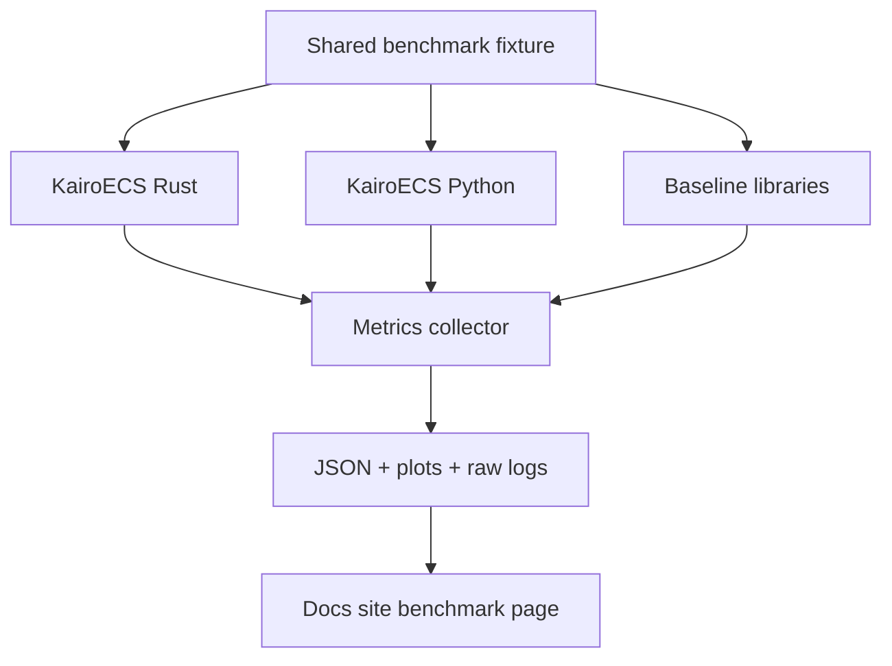

# Benchmarks and Reproducibility Plan

This page is the shared benchmark note that Track 18 points to. It stays
concrete by anchoring claims to the committed benchmark plan, the fixture
manifest, and the smoke workflow.

## Benchmark principles

- Benchmark whole workflows and micro-operations.
- Publish hardware, OS, compiler, commit SHA, feature flags, and package versions.
- Compare against credible baselines without mocking away their strengths.
- Avoid claims like "fastest" unless the benchmark is broad and reproducible.
- Keep the benchmark inventory fixed to the committed ready fixtures and canonical scenarios:
  - ready fixture IDs: `scheduler_ordering_v1`, `scheduler_cancellation_v1`, `rng_reproducibility_v1`
  - canonical benchmark scenarios: `schedule_1m_events`, `pop_1m_events`, `schedule_cancel_1m_mixed`, `create_1m_entities`, `component_insert_1m`, `hybrid_des_abm_smoke_100k`

## Baseline candidates

| Paradigm | Ecosystem | Candidate baseline |
|---|---|---|
| DES | Python | SimPy, salabim |
| DES | R | simmer |
| DES | Julia | ConcurrentSim.jl |
| ABM | Python | Mesa |
| ABM | Julia | Agents.jl |
| DES | C# | SimSharp |
| Hybrid | Commercial conceptual benchmark | AnyLogic-style examples; no direct performance comparison unless licensed/appropriate |

## Metrics

```text
events/sec
scheduled events/sec
cancelled events/sec
memory per event
memory per entity
resource queue throughput
agent decisions/sec
Arrow export throughput
binding call overhead
cold import/startup time
scenario replication throughput
```

## Required outputs

```text
benchmark-result.json
benchmark-environment.json
benchmark-command.sh
raw criterion output
plots for docs site
caveats and fairness notes
```

Raw outputs are preserved as the primary evidence. Summary tables, plots, and docs-page snippets may be derived from them, but the benchmark claim should still point back to the raw criterion output, environment capture, command capture, and the committed fixture or scenario name that produced it.

## Fixture and smoke anchors

Track 18's reproducibility story is tied to the ready fixture IDs in
`conformance/fixtures/manifest.json`:

- `scheduler_ordering_v1`
- `scheduler_cancellation_v1`
- `rng_reproducibility_v1`

The benchmark smoke workflow in `.github/workflows/benchmark-smoke.yml`
checks repo shape and runs `cargo bench --workspace --no-run`. That makes the
page point at a real gate rather than a silent skip.

The benchmark plan in `benches/benchmark-plan.md` should say which fixture or
benchmark target is being compared, which baseline is used, and what level of
variance is acceptable.


