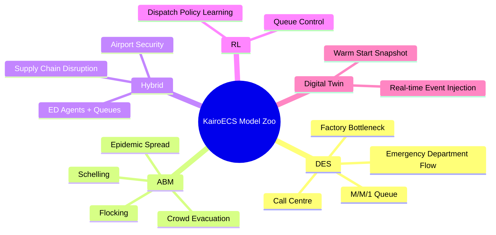

# Domain Starter Kits and Model Zoo

## Purpose

The model zoo is not a toy gallery. It is the adoption, teaching, conformance, and credibility surface for KairoECS.

## Initial examples

| Category | Example | Why it matters |
|---|---|---|
| DES | M/M/1 queue | Small canonical correctness example. |
| DES | Factory bottleneck | Classic resource/queue use case. |
| DES | Emergency department flow | Healthcare and policy relevance. |
| ABM | Flocking | Agent movement and local behavior. |
| ABM | Schelling segregation | Classic social ABM. |
| ABM | Epidemic spread | Agent state transitions and stochasticity. |
| Hybrid | Hospital ED agents + queues | Shows DES/ABM parity. |
| Hybrid | Supply chain disruption | Operations use case. |
| RL | Queue control | Reinforcement-learning bridge. |

## Example completeness standard

Each example must include:

```text
README
model code
scenario manifest
seed manifest example
expected telemetry schema
reproducibility command
summary statistics
known limitations
Rust version initially
Python version for user-facing tutorial where feasible
```


