# Experiment Runner and Scenario Management

The experiment runner is the bridge from “a simulation model” to “usable scientific or operational evidence.”

## `kairo-ecs-experiment` responsibilities

```text
load scenario manifests
expand parameter sweeps
allocate deterministic seeds
run replications
parallelize independent scenarios
resume failed/incomplete runs
write Arrow/Parquet outputs
write result manifests
produce comparison reports
```

## Scenario manifest shape

```yaml
schema_version: kairoecs.scenario.v1
scenario_id: factory_bottleneck_v1
model:
  id: examples/des/factory_bottleneck
  engine_version: 0.2.0
parameters:
  arrival_rate: 1.2
  service_rate: 1.0
runs:
  replications: 100
  concurrency: 4
seed_policy:
  base_seed: 12345
  stream_strategy: per_replication_per_agent
replay:
  fixture_id: scheduler_ordering_v1
  trace: conformance/fixtures/deterministic_ordering.json
outputs:
  format: parquet
  artifact_root: runs/factory_bottleneck_v1
```

## Replay command

```bash
kairoecs-experiment replay --scenario scenarios/factory_bottleneck_v1.yaml --seed-manifest scenarios/seeds.yaml --fixture scheduler_ordering_v1 --output runs/factory_bottleneck_v1
```

## Output shape

Each run writes a manifest and machine-readable outputs:

- `runs/factory_bottleneck_v1/manifest.json`
- `runs/factory_bottleneck_v1/replications.parquet`
- `runs/factory_bottleneck_v1/summary.json`
- `runs/factory_bottleneck_v1/replay-comparison.json`

The run manifest records:

- `scenario_id`
- `fixture_id`
- `base_seed`
- `replications`
- `status`
- `output_root`

## Comparison flow

1. Load the scenario manifest and the seed manifest.
2. Re-run the selected fixture, such as `scheduler_ordering_v1`.
3. Compare the replay trace to the stored output manifest and summary metrics.
4. Flag any drift in ordering, counts, or summary values.
5. Emit a comparison report for the runner log and release gate.

```mermaid
flowchart LR
    Manifest[Scenario manifest]
    Seeds[Seed manifest]
    Sweep[Parameter sweep expander]
    Replay[Replay runner]
    Queue[Run queue]
    Workers[Parallel workers]
    KairoECS[KairoECS engine]
    Arrow[Arrow/Parquet outputs]
    Results[Run manifest]
    Compare[Comparison report]

    Manifest --> Sweep
    Sweep --> Seeds
    Seeds --> Queue
    Queue --> Replay
    Replay --> Workers
    Workers --> KairoECS
    KairoECS --> Arrow
    Arrow --> Results
    Replay --> Results
    Results --> Compare
```


