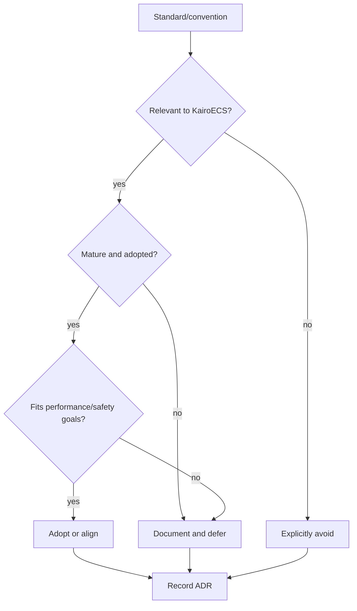

# Interoperability Standards Review

KairoECS should avoid inventing incompatible formats where mature standards or conventions exist.

## Canonical Track 26 status mapping

The public review note lives at `docs/interoperability/standards-review.md`.
Use the same status vocabulary everywhere:

| Label | Meaning |
|---|---|
| Supported | Checked-in implementation or contract surface exists and evidence is named. |
| Partial | A subset is aligned or scaffolded, but missing behavior is explicit. |
| Deferred | The standard is a named future bridge target, not current support. |
| Unsupported | The item is a comparison or teaching reference only. |

| Standard | Current label | Release-language guard |
|---|---|---|
| DEVS | Partial | Conceptual event-ordering/replay alignment only; no DEVS runtime compatibility. |
| FMI/FMU | Partial | Unpacked-layout and lifecycle/export scaffolding only; no arbitrary FMU execution claim. |
| SBML | Deferred | No parser, writer, solver bridge, or fixtures. |
| CellML | Deferred | No parser, writer, solver bridge, or fixtures. |
| OpenTelemetry semantic conventions | Partial | Naming guidance only until a native exporter and OTLP fixtures exist. |
| Arrow C Data Interface | Partial | Field-level Arrow type alignment only until ArrowArray/ArrowSchema FFI fixtures exist. |
| Arrow IPC | Deferred | Integration target only; current event-log roundtrip is smoke bytes, not Arrow IPC. |
| Parquet | Deferred | Planned analytical output only; no writer or reader fixtures. |
| Mesa, Agents.jl, MASON, NetLogo | Unsupported | Teaching and migration comparison only. |
| SimPy, simmer, ConcurrentSim.jl, SimSharp | Unsupported | Teaching and migration comparison only. |
| AnyLogic-style multimethod modeling | Unsupported | Mental-model comparison only. |

## Standards and ecosystem mappings to review

| Area | Candidate | Track impact |
|---|---|---|
| DES theory | DEVS concepts | Core/event model terminology. |
| Digital twins | FMI/FMU | Future import/export and real-time mode. |
| Continuous/scientific models | SBML, CellML | Future hybrid/continuous simulation interfaces. |
| Telemetry | Arrow C Data Interface, Arrow IPC, Parquet | Track 04 schema and host-language interop. |
| Observability | OpenTelemetry semantic conventions | Trace/log naming where suitable. |
| ABM ecosystem | Mesa, Agents.jl, MASON, NetLogo concepts | API teaching and migration docs. |
| DES ecosystem | SimPy, simmer, ConcurrentSim.jl, SimSharp concepts | Trajectory/process API mapping. |
| Hybrid tools | AnyLogic-style multimethod modeling | User mental model, not code compatibility. |

## Output format

Each reviewed standard should receive:

```text
summary
relevance to KairoECS
adopt/defer/avoid recommendation
compatibility risks
mapping table
follow-up implementation track if needed
```


