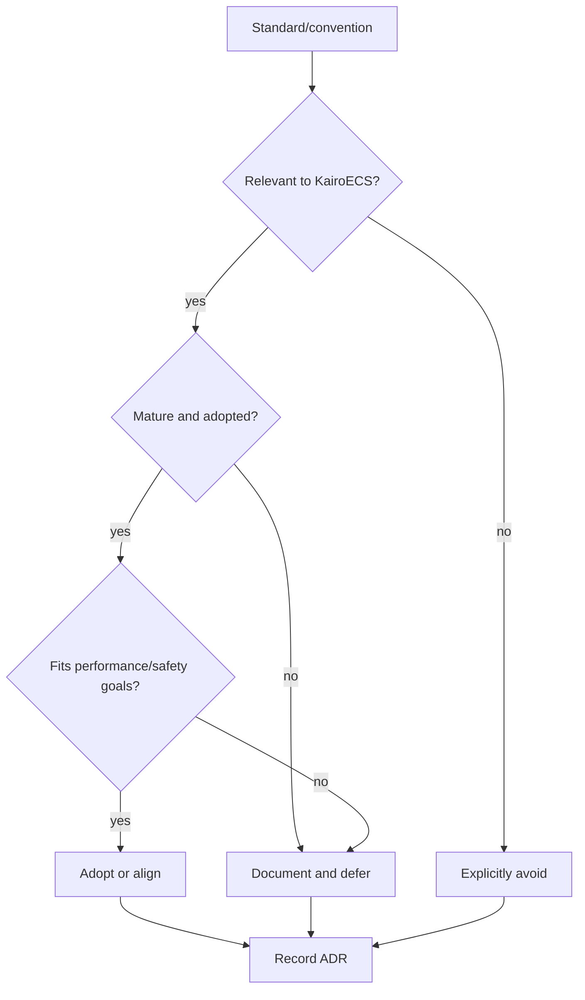

# Interoperability Standards Review

KairoECS should avoid inventing incompatible formats where mature standards or conventions exist.

## Standards and ecosystem mappings to review

| Area | Candidate | Track impact |
|---|---|---|
| DES theory | DEVS concepts | Core/event model terminology. |
| Digital twins | FMI/FMU | Future import/export and real-time mode. |
| Continuous/scientific models | SBML, CellML | Future hybrid/continuous simulation interfaces. |
| Telemetry | Arrow C Data Interface, Arrow IPC, Parquet | Track 04 schema and host-language interop. |
| Observability | OpenTelemetry semantic conventions | Trace/log naming where suitable. |
| ABM ecosystem | Mesa, Agents.jl, MASON, NetLogo concepts | API teaching and migration docs. |
| DES ecosystem | SimPy, simmer, ConcurrentSim.jl, SimSharp concepts | Trajectory/process API mapping. |
| Hybrid tools | AnyLogic-style multimethod modeling | User mental model, not code compatibility. |

## Output format

Each reviewed standard should receive:

```text
summary
relevance to KairoECS
adopt/defer/avoid recommendation
compatibility risks
mapping table
follow-up implementation track if needed
```


