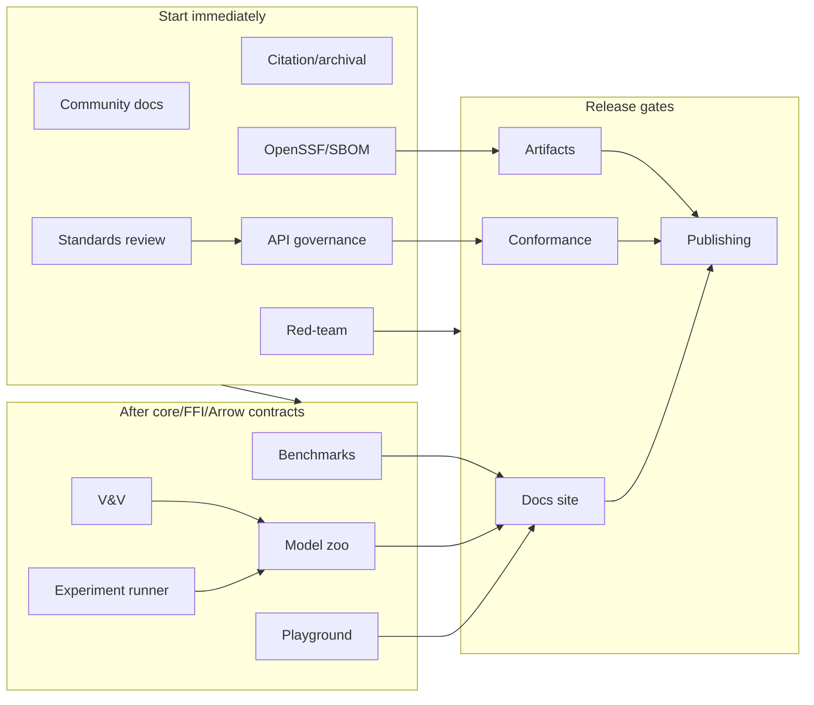

# Parallel Execution Plan

## Contract-first lanes

KairoECS should not force a fully sequential build. The first milestone is not a full kernel; it is a set of stable contracts that enable parallel work.

## Parallel lane table

| Lane | Tracks | Can start when | Main blocker |
|---|---|---|---|
| Foundation | 00, 13, 14, 16 | Immediately | Naming availability and repo policy choices |
| Core contracts | 01 contracts, 12 fixture design | Track 00 skeleton exists | SimTime and ID semantics |
| Core implementation | 01 scheduler/ECS/RNG | Core contracts accepted | Benchmark-driven design decisions |
| Bridge | 02 FFI/UniFFI/Diplomat | FFI contract draft accepted | Ownership and error model |
| Modeling APIs | 03 DES/ABM | ECS + scheduler ports defined | Callback/event semantics |
| Telemetry | 04 Arrow | Arrow schema draft accepted | Event/entity schema stability |
| Visualization | 05 Viz | ECS snapshot contract accepted | Rendering separate from headless core |
| Bindings | 06-11 | FFI release candidate | Native library packaging |
| Productization | 13-16 | Starts immediately, hardens later | Release credentials and package names |

## Recommended first four subagent batches

### Batch 0: Repository skeleton

```text
foundation-agent
ci-agent
docs-agent
release-agent
security-agent
```

Outputs:

```text
Cargo workspace skeleton
rust-toolchain.toml
LICENSE
CONTRIBUTING.md
SECURITY.md
CODEOWNERS
ADR template
initial GitHub Actions
Docusaurus skeleton
```

### Batch 1: Contracts

```text
contracts-agent
ffi-agent
arrow-agent
conformance-agent
performance-agent
```

Outputs:

```text
SimTime/ID/error contracts
FFI ownership/error contract
Arrow schema draft
Conformance fixture format
Benchmark target list
```

### Batch 2: Core and bridge implementation

```text
core-scheduler-agent
ecs-agent
rng-agent
des-api-agent
abm-api-agent
ffi-agent
arrow-agent
```

Outputs:

```text
Deterministic scheduler
ECS state model
Deterministic RNG streams
DES resource/trajectory skeleton
ABM behavior skeleton
C ABI prototype
Arrow IPC prototype
```

### Batch 3: Binding fanout

```text
python-agent
r-agent
julia-agent
typescript-agent
csharp-agent
go-agent
conformance-agent
docs-agent
release-agent
```

Outputs:

```text
Python 3.10-3.14 smoke test
R smoke test
Julia smoke test
TypeScript/Wasm smoke test
C# .NET 10-11 smoke test
Go smoke test
Shared fixture test report
Registry dry-run results
```

## Integration checkpoints

| Checkpoint | Required passing gates |
|---|---|
| IC-0 | Repo skeleton builds placeholder CI |
| IC-1 | Contracts accepted and ADRs written |
| IC-2 | Rust core deterministic fixtures pass |
| IC-3 | FFI smoke tests pass on Linux/macOS/Windows |
| IC-4 | Arrow IPC readable in Python/R/Julia/TypeScript/C#/Go |
| IC-5 | All bindings pass shared conformance fixtures |
| IC-6 | Docs site builds and release dry-run succeeds |
| IC-7 | Release candidate published to test registries/pre-release artifacts |

---

# Parallel execution expansion for tracks 17-26

## Immediate subagent lanes

These lanes can start without waiting for core implementation:

```text
community-agent: docs/community, issue templates, contributor path
research-agent: CITATION/codemeta/JOSS/Zenodo planning
security-agent: OpenSSF, Scorecard, SBOM, attestations
api-governance-agent: API review templates and compatibility policy
standards-agent: interoperability review
red-team-agent: continuous challenge review
```

## Contract-dependent lanes

```text
benchmark-agent: after first scheduler benchmark contract
vv-agent: after event trace and seed manifest contracts
experiment-agent: after scenario manifest and Arrow output contract
model-zoo-agent: after DES/ABM API drafts
playground-agent: after Wasm/viz snapshot contracts
```

## Merge discipline

- Tracks 17-26 may create docs and templates in parallel.
- Any change to `conductor/track-map.md`, `conductor/package-catalog.md`, or public compatibility promises requires api-governance-agent review.
- Any change to release workflows requires security-agent and release-agent review.
- Any benchmark claim requires benchmark-agent and red-team-agent review.

## Mermaid: parallel trust/adoption execution


