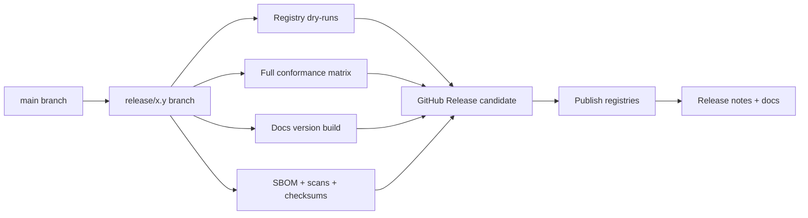

# KairoECS Release Engineering

## Release model

KairoECS has four compatibility surfaces:

```text
1. Rust crate API
2. C ABI
3. Host-language APIs
4. Arrow telemetry schemas
```

A release is only stable if all four surfaces have documented compatibility expectations.

The current checked-in package surfaces are the Rust workspace crates in `crates/`, the Python package in `bindings/python/`, the R package in `bindings/r/`, the Julia package in `bindings/julia/`, the TypeScript package in `bindings/typescript/`, the C# package in `bindings/csharp/`, and the Go module in `bindings/go/`.

## Early-stage policy

- This track plans release mechanics before production publishing.
- Draft releases and dry-runs are the default.
- Production registry writes wait until registry names, toolchains, and package metadata are verified.
- Any public API or schema change that affects downstream packages must be recorded in the packaging docs first.

## Versioning

Use SemVer at the product level, with explicit schema/ABI versions:

```text
KairoECS package version: 0.4.0
C ABI version: kairo_ecs_ffi_abi_v1
Arrow event schema: kairo_ecs.event_log.v1
Conformance suite: kairoecs.conformance.v1
```

## Registry ladder

| Ecosystem | First step | Second step | Stable path |
|---|---|---|---|
| Rust | `cargo package` and `cargo publish --dry-run` | crates.io draft readiness | crates.io publish + GitHub Release |
| Python | Build wheel/sdist and validate metadata | TestPyPI upload dry-run | PyPI publish |
| R | Build package and check native loading | GitHub release or R-universe artifact build | CRAN later |
| Julia | Validate package metadata and artifacts | GitHub/dev registry prep | General Registry later |
| TypeScript | `npm pack` and type validation | npm publish dry-run | npm publish |
| C# | `dotnet pack` and local package inspection | NuGet prerelease validation | NuGet publish |
| Go | `github.com/edithatogo/kairos/bindings/go` module path and version plan | semantic tag rehearsal | semantic tag and module release |

## Release train



## Required release artifacts

```text
source tarball
checksums
SBOM
native libraries
C headers
Python wheels/sdist
R package artifact
Julia artifact metadata
npm package
NuGet package
Go tag
API docs
GitHub Pages docs version
changelog
migration guide if breaking changes
```

## Supply-chain gates

A release is not eligible for beta, RC, or 1.0 unless these checks are present and green:

- `.github/workflows/scorecard.yml`
- `.github/workflows/dependency-review.yml`
- `.github/workflows/sbom-attestations.yml`
- `.github/workflows/release-attestations.yml`
- `SECURITY.md`
- `CODEOWNERS`
- `conductor/quality-gates.md` supply-chain gate section

Waivers and exceptions are recorded in `conductor/quality-gates.md` and must state:

1. the exact missing or failing check
2. the release stage affected
3. the approver
4. the expiry or follow-up issue

Temporary toolchain gaps can be allowed-failure only for alpha. They do not create a standing policy waiver.

## Citation and archive requirements

Before any public release write, the release note must include:

- the exact release version
- the citation files used for the release: `CITATION.cff`, `codemeta.json`, `.zenodo.json`
- the archive status: draft, sandbox, or DOI-minted
- the DOI or draft Zenodo link if one exists
- the source archive location
- reproducibility instructions
- any author, version, repository-code, or license changes

The citation metadata path is:

1. Update `CITATION.cff`, `codemeta.json`, and `.zenodo.json`.
2. Record the archive note in the release note.
3. Use a Zenodo draft or sandbox deposition first.
4. Mint the DOI only after the archive record and release note are complete.
5. Keep the release note and archive metadata in sync before any public write.

## Actionable release checklist

1. Confirm package names and fallback names in `conductor/package-matrix.md`.
2. Confirm the first registry target for each ecosystem.
3. Record the dry-run command for each current package surface in the package catalog.
4. Keep GitHub Releases draft-only until all package checks pass.
5. Keep registry credentials out of the repo and use the least-privileged release mechanism available.
6. Add release notes, citation metadata references, and compatibility notes before any public package write.

## Pre-release policy

Use pre-release tags for binding surfaces before 1.0:

```text
0.4.0-alpha.1
0.4.0-beta.1
1.0.0-rc.1
```

## Maintenance windows

| Surface | Minimum support policy |
|---|---|
| Rust | stable Rust + stated MSRV |
| Python | 3.10-3.14 initially; remove EOL versions only in minor/major releases with notice |
| C# | .NET 10-11 target as requested; revise when runtime lifecycle requires |
| Arrow schemas | backward-compatible additive changes within same major schema version |
| FFI ABI | no breaking ABI changes without major version or side-by-side ABI |

## Release checklist

See `docs/release/release-checklist.md`.
The release checklist should remain compatible with the early-stage draft-only policy above.
