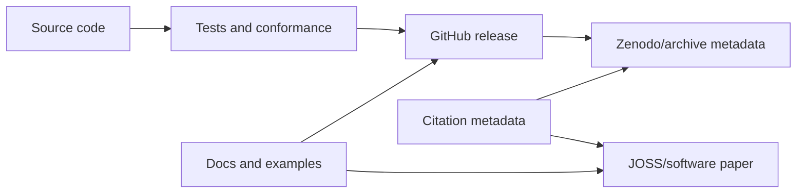

# Research Software, Citation and Archival Plan

KairoECS should be usable by researchers, policy analysts, health economists, operations researchers, and digital-twin teams. That requires citation and archival infrastructure.

## Required files

```text
CITATION.cff
codemeta.json
.zenodo.json
JOSS-PAPER.md
REPRODUCIBILITY.md
```

## Release archive contents

```text
source archive
native artifacts
SBOM
checksums
artifact attestations
benchmark metadata
API compatibility report
Arrow schema versions
scenario manifest schema versions
citation metadata
```

## JOSS readiness checklist

- Clear research purpose.
- Installation instructions.
- Documentation and examples.
- Tests and CI.
- Community guidelines.
- Citation metadata.
- Statement of need.


