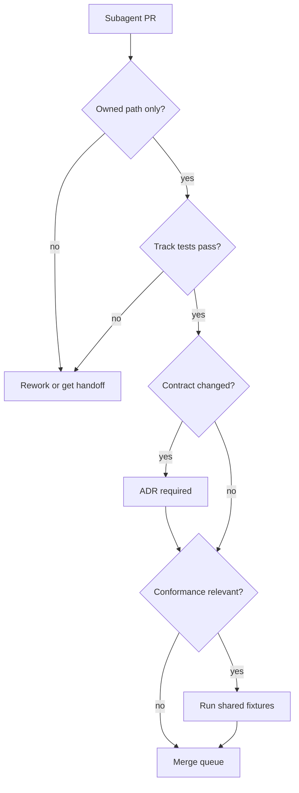
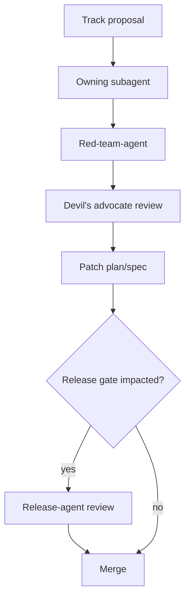

# KairoECS Subagent Plan

## Goal

Enable parallel implementation with minimal merge conflicts and clear quality ownership.

## Subagent roster

| Subagent | Mission | Must produce | Cannot change without handoff |
|---|---|---|---|
| foundation-agent | Repo scaffolding, license, governance, naming due diligence | root governance files, ADR structure | core implementation |
| contracts-agent | SimTime, IDs, public DTOs, contract docs | `kairo-ecs-types`, contracts | language wrappers |
| core-scheduler-agent | Deterministic event queue and run loop | scheduler tests/benches | FFI wrapper code |
| ecs-agent | ECS storage and entity/component API | storage tests/benches | scheduler internals |
| rng-agent | Deterministic per-agent RNG streams | RNG fixtures | host bindings |
| ffi-agent | Stable C ABI and handle ownership | headers, ABI tests | host-language ergonomics |
| uniffi-agent | UniFFI facade | generated binding scaffold | C ABI contract |
| diplomat-agent | Diplomat facade | generated binding scaffold | C ABI contract |
| des-api-agent | DES trajectory/resource semantics | DES examples/tests | ECS internals |
| abm-api-agent | ABM behavior/agent semantics | ABM examples/tests | scheduler internals |
| arrow-agent | Arrow telemetry | schemas and IPC tests | DES/ABM behavior semantics |
| viz-agent | WGPU/Bevy visualizer | optional viewer, snapshots | headless core |
| python-agent | Python package 3.10-3.14 | wheels, tests, docs | FFI internals |
| r-agent | R package | R CMD check, pkgdown docs | FFI internals |
| julia-agent | Julia package | Pkg.test, Documenter docs | FFI internals |
| typescript-agent | Wasm/npm package | npm tests, typed docs | FFI internals |
| csharp-agent | C# .NET 10-11 package | NuGet build, xUnit tests | FFI internals |
| go-agent | Go module | go test, examples | FFI internals |
| conformance-agent | Cross-language correctness | shared fixtures, test harness | package implementation |
| performance-agent | Benchmarks and regression gates | baseline results, thresholds | public API design |
| ci-agent | GitHub Actions and automation | workflows, caches, matrices | product code without owner |
| docs-agent | Docs site and examples | GitHub Pages site | API contracts without ADR |
| release-agent | Registries, packages, release trains | release workflow/checklists | compatibility policy alone |
| security-agent | Supply chain and vulnerability process | SECURITY.md, scans, SBOM plan | release approvals alone |

## Worktree strategy

Use one branch/worktree per subagent or track:

```bash
git worktree add ../kairo-ecs-t01-core -b track/01-heart-core-ecs
git worktree add ../kairo-ecs-t02-ffi -b track/02-ffi-bridge
git worktree add ../kairo-ecs-t06-python -b track/06-python-binding
git worktree add ../kairo-ecs-t10-csharp -b track/10-csharp-dotnet
```

Branch naming:

```text
track/<nn>-<slug>
subagent/<name>/<short-task>
contract/<surface>/<version>
release/<version>
```

## Subagent handoff template

Every subagent should write `handoff.md`:

```markdown
# Handoff

## Summary

## Files changed

## Contracts consumed

## Contracts changed

## Tests added

## Known risks

## Follow-up issues

## Integration notes
```

## Conflict prevention

1. Subagents do not edit another subagent's owned paths.
2. Contract changes are proposed via ADR.
3. Generated files are either checked in with clear provenance or generated in CI, not both ambiguously.
4. Shared fixtures are versioned.
5. Binding agents must not invent behavior; they implement conformance fixtures.

## Review routing




## Additional SOTA/community subagents

| Subagent | Mission | Must produce | Cannot change without handoff |
|---|---|---|---|
| community-agent | Adoption funnel, tutorials, contributor UX | community plan, issue labels, example gallery | release claims |
| benchmark-agent | Fair reproducible benchmarks | benchmark harness, raw result schema | marketing claims alone |
| research-software-agent | Citation/archival/JOSS readiness | CITATION.cff, codemeta, Zenodo, paper skeleton | author/license metadata without review |
| vv-uq-agent | Verification, validation, uncertainty | replay and scenario manifest specs | kernel determinism semantics |
| experiment-agent | Scenario/replication runner | experiment manifest and CLI spec | scheduler internals |
| model-zoo-agent | Practical examples | model zoo manifests and starter models | core crate APIs |
| playground-agent | Web demos | Wasm demo plan and UX docs | visualization core contract |
| api-governance-agent | API review consistency | API review template and compatibility matrix | API acceptance without maintainers |
| interop-agent | Standards/migration mapping | standards review docs | core architecture alone |
| dx-agent | Contributor environments | devcontainer/Nix/devbox/bootstrap plan | CI release gates alone |
| redteam-agent | Adversarial review | red-team findings and release blockers | mitigations without owner agreement |
| gpu-compute-agent | GPU-accelerated ECS operations | `kairo-ecs-gpu`, GPU parity tests | core scheduler internals |
| webgpu-agent | WebGPU browser-side compute | `kairo-ecs-webgpu`, browser demos | Wasm GPU kernel design |
| pdes-agent | Parallel discrete-event simulation | `kairo-ecs-pdes`, GVT tests | sequential scheduler contract |
| distributed-agent | Multi-node distributed simulation | `kairo-ecs-mpi`, `kairo-ecs-grpc`, cluster tests | PDES LP model |
| streaming-agent | Real-time telemetry streaming | `kairo-ecs-streaming`, Kafka/Arrow Flight tests | Arrow telemetry schema |
| ml-integration-agent | ONNX inference and Gymnasium environments | `kairo-ecs-ml`, ML surrogate examples | model zoo domain semantics |
| fmi-agent | FMI/FMU and digital twin co-simulation | `kairo-ecs-fmi`, FMI import/export, AAS | FFI C ABI contract |
| cloud-agent | Docker/Kubernetes batch runners | `docker/`, `k8s/`, spot checkpointing | release packaging pipeline |
| timetravel-agent | Deterministic trace/replay debugging | `kairo-ecs-debug`, breakpoints, time-travel demos | deterministic core semantics |
```

---

# Community, trust, and red-team subagents

| Subagent | Mission | Must produce | Cannot change without handoff |
|---|---|---|---|
| community-agent | Adoption, onboarding, contributor experience | docs/community, issue templates, adoption plan | core/FFI contracts |
| benchmark-agent | Fair comparative benchmarks | benchmark fixtures, metadata, docs | performance claims without evidence |
| research-agent | Citation, archival, research-software readiness | CITATION/codemeta/JOSS/Zenodo plans | release metadata without release-agent |
| vv-agent | Verification, validation, uncertainty | replay/seed/scenario manifest plans | scheduler determinism contract |
| experiment-agent | Scenario sweeps, replications, batch runs | kairo-ecs-experiment plan, manifest schema | telemetry schema without arrow-agent |
| model-zoo-agent | Domain examples and starter kits | model zoo docs/examples | core internals |
| playground-agent | Browser demos and visualization UX | playground plan, Wasm demo expectations | headless core dependencies |
| api-governance-agent | Cross-language API review | API review templates, compatibility gates | public API contract alone |
| standards-agent | Interoperability standards mapping | standards review, ADR recommendations | implementation commitments alone |
| red-team-agent | Failure-mode review | red-team findings, kill/pivot criteria | direct code changes without owner |

## Red-team loop


