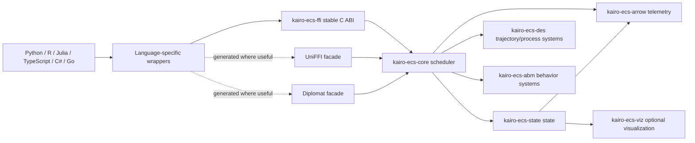

# KairoECS Technical Stack

## Project identity

**KairoECS** is a Rust-first, multi-method simulation engine for DES and ABM. The name emphasizes precise event timing: the right event at the right simulated moment.

The public product should feel like one coherent library:

```text
Python/R/Julia/TypeScript/C#/Go users install a KairoECS package.
Rust contributors work in the kairo-ecs-* crate ecosystem.
```

## Core architecture



## Workspace crates

| Crate | Purpose | Dependency direction | Primary owner subagent |
|---|---|---|---|
| `kairo-ecs-types` | SimTime, IDs, errors, versioned DTOs | Lowest-level shared contract | contracts-agent |
| `kairo-ecs-core` | event scheduler, run loop, queue, cancellation | depends on `kairo-ecs-types` | core-scheduler-agent |
| `kairo-ecs-state` | entity/component storage and query APIs | depends on `kairo-ecs-types` and later core ports | ecs-agent |
| `kairo-ecs-rng` | deterministic RNG streams and distributions | depends on `kairo-ecs-types` | rng-agent |
| `kairo-ecs-des` | trajectory/process/resource semantics | depends on core + ecs | des-api-agent |
| `kairo-ecs-abm` | behavior callbacks, agent decision systems | depends on core + ecs | abm-api-agent |
| `kairo-ecs-arrow` | Arrow schemas, RecordBatch builders, IPC/Parquet | depends on types/core/ecs DTOs only | arrow-agent |
| `kairo-ecs-ffi` | stable C ABI, ownership, error buffers, handles | depends on public facade crates | ffi-agent |
| `kairo-ecs-uniffi` | UniFFI-generated surfaces where suitable | depends on ffi/facade | uniffi-agent |
| `kairo-ecs-diplomat` | Diplomat-generated surfaces where suitable | depends on ffi/facade | diplomat-agent |
| `kairo-ecs-wasm` | TypeScript/Wasm package bridge | depends on ffi/facade/arrow | typescript-agent |
| `kairo-ecs-viz` | optional WGPU/Bevy visualization | depends on ecs snapshots and telemetry | viz-agent |
| `kairo-ecs-cli` | developer CLI, fixture runner, smoke harness | depends on core/ecs/arrow | cli-agent |
| `kairo-ecs-conformance` | shared fixtures and validation harnesses | depends on public APIs | conformance-agent |
| `kairo-ecs-bench` | benchmark harnesses | depends on core/ecs/arrow | performance-agent |

## Rust package/dependency plan

Pin exact versions during implementation. Keep high-risk dependencies isolated by crate.

| Area | Recommended crates/tools | Notes |
|---|---|---|
| Core errors | `thiserror` | Stable Rust error model. |
| Serialization | `serde`, `serde_json`, `postcard` optional | Core state checkpointing and fixture interchange. |
| Observability | `tracing`, `tracing-subscriber` | Zero-cost disabled telemetry; structured debug traces. |
| Collections | `smallvec`, `slab`, `slotmap`, `hashbrown`, `indexmap` | Use where benchmarks justify them. |
| RNG | `rand`, `rand_core`, `rand_chacha`, `rand_xoshiro`, `rand_distr` | Per-agent deterministic streams. |
| Statistics | `statrs` optional | Validation tests and distribution utilities. |
| Arrow | `arrow-array`, `arrow-schema`, `arrow-ipc`, `parquet` | Keep in `kairo-ecs-arrow`, not core. |
| FFI | `libc`, `cbindgen`, `ffi-support` or small custom status layer | Avoid leaking Rust types. |
| UniFFI | `uniffi` | Use selectively; do not make it the only ABI strategy. |
| Diplomat | `diplomat`, `diplomat-runtime` | Use selectively for generated bindings/value types. |
| Wasm | `wasm-bindgen`, `serde-wasm-bindgen`, `js-sys`, `web-sys`, `wasm-bindgen-test`, `console_error_panic_hook` | Browser/Node TypeScript support. |
| Visualization | `wgpu`, `bevy` optional, `bytemuck` | Keep optional and out of headless builds. |
| CLI/dev | `clap`, `miette`, `serde_yaml`, `toml` | Developer tools and fixture runners. |
| Testing | `proptest`, `rstest`, `insta`, `pretty_assertions`, `tempfile` | Unit/property/snapshot tests. |
| Benchmarking | `criterion`, `iai-callgrind` optional, `divan` optional | Scheduler and ECS benchmarks. |
| Fuzzing | `cargo-fuzz`, `arbitrary` | FFI and scheduler fuzz targets. |
| Quality | `cargo-nextest`, `cargo-deny`, `cargo-audit`, `cargo-llvm-cov`, `cargo-semver-checks` | CI gates. |

## Language package plan

### Python binding: Python 3.10-3.14

Preferred package names, subject to availability:

```text
Python distribution: kairo-ecs
Python import: kairo_ecs
```

Use `maturin` with PyO3 only where Python-native objects are needed. Prefer an `abi3-py310` strategy if the API can remain within the stable ABI so one wheel family can cover Python 3.10-3.14 per platform.

Runtime packages:

```text
pyarrow
numpy optional
pandas optional
polars optional
typing-extensions for Python 3.10 ergonomics
```

Dev packages:

```text
maturin
cibuildwheel
pytest
hypothesis
pytest-benchmark
ruff
mypy or pyright
build
twine
```

### R binding

Preferred distribution path:

```text
GitHub + R-universe first, CRAN later.
```

Runtime packages:

```text
arrow
jsonlite
rlang
vctrs
data.table optional
```

Dev/release packages:

```text
testthat
roxygen2
pkgdown
lintr
styler
rcmdcheck
rhub
usethis
devtools
```

Keep the Rust boundary C-compatible. Use `.Call`/external pointers or `extendr` only if it does not compromise ABI stability.

### Julia binding

Runtime packages:

```text
Arrow.jl
DataFrames.jl optional
JSON3.jl
StructTypes.jl
```

Dev/release packages:

```text
Documenter.jl
Aqua.jl
JuliaFormatter.jl
BenchmarkTools.jl
BinaryBuilder.jl
JLLWrappers.jl
```

Use `ccall` against the stable C ABI and Julia Artifacts for native library distribution.

### TypeScript/Wasm binding

Runtime/dev packages:

```text
typescript
vite
vitest
wasm-pack
wasm-bindgen-cli
typedoc
eslint
prettier
apache-arrow
@types/node
playwright optional for browser smoke tests
```

Support both browser and Node where feasible. Keep real-time visualization separate from the simulation kernel.

### C# binding: .NET 10-11

Target frameworks:

```xml
<TargetFrameworks>net10.0;net11.0</TargetFrameworks>
```

Implementation pattern:

```text
SafeHandle for native engine ownership
NativeLibrary loading for platform-specific assets
P/Invoke over C ABI
Span/Memory-based accessors where possible
Apache.Arrow for telemetry reading
```

Dev/release packages/tools:

```text
Microsoft.NET.Test.Sdk
xunit
xunit.runner.visualstudio
coverlet.collector
BenchmarkDotNet
Microsoft.CodeAnalysis.NetAnalyzers
StyleCop.Analyzers optional
DocFX for API docs
NuGet package signing/checks
```

Treat `.NET 11` as a requested target. If the current runner only supports previews, make it an experimental CI lane until GA.

### Go binding

Implementation pattern:

```text
cgo wrapper over kairo-ecs-ffi
explicit Close() for handles
no hot-loop Go callbacks unless marked experimental
Arrow Go library for telemetry where viable
```

Dev/release tools:

```text
go test
go vet
gofmt
golangci-lint
staticcheck
benchstat
goreleaser optional
```

## Documentation stack

Recommended public docs stack: **Docusaurus** for versioned docs and multi-language examples.

Ecosystem-native API docs:

| Ecosystem | Docs |
|---|---|
| Rust | docs.rs + `cargo doc` |
| Python | pdoc or Sphinx/MkDocs API pages |
| R | pkgdown |
| Julia | Documenter.jl |
| TypeScript | TypeDoc |
| C# | DocFX/XML docs |
| Go | pkg.go.dev |
| C ABI | generated header + manual reference |

## Registry/delivery targets

| Surface | Registry/delivery |
|---|---|
| Rust crates | crates.io |
| C ABI libraries | GitHub Releases |
| Python | TestPyPI then PyPI |
| R | R-universe, then CRAN after maturity |
| Julia | private registry/dev release, then General Registry/JLL artifacts |
| TypeScript | npm |
| C# | NuGet |
| Go | Git tags and Go module proxy |
| Docs | GitHub Pages |
