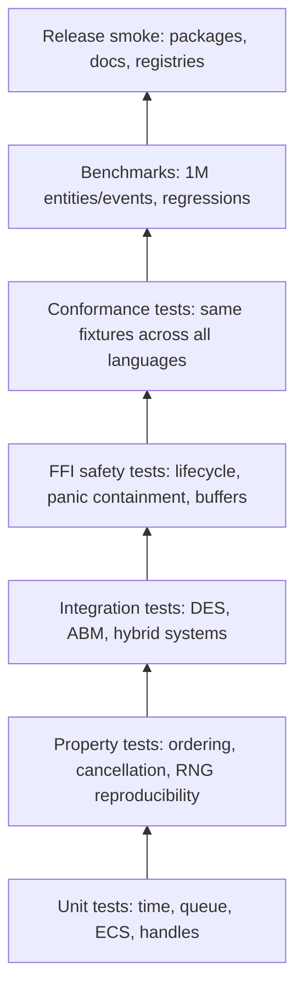

# KairoECS Testing Strategy

KairoECS needs more than conventional unit tests because the value proposition is correctness, determinism, speed, and cross-language parity.

## Test pyramid

```mermaid
pyramid
    title KairoECS Testing Pyramid
```

Mermaid does not support a universal pyramid syntax in all renderers, so use this fallback diagram:



## Required test categories

### 1. Core correctness

- SimTime conversion and ordering.
- SimDuration arithmetic and overflow handling.
- Event priority ordering.
- Stable insertion sequence ordering.
- Cancellation behavior.
- Zero-delay loop guardrails.
- Bounded run loops.

### 2. Determinism

- Same seed and inputs produce identical traces.
- Per-agent RNG stream reproducibility.
- Cross-platform deterministic fixture outputs.
- Cross-language deterministic fixture outputs.

### 3. ECS and scale

- Entity create/delete/reuse.
- Component insert/update/remove.
- Query correctness.
- 1,000,000+ entity handle benchmark.
- Memory overhead tracking.

### 4. DES/ABM/hybrid behavior

- Factory bottleneck DES fixture.
- Flocking ABM fixture.
- Hybrid fixture: agents choose behavior and enter a DES resource queue.
- Resource contention and priority queue behavior.

### 5. FFI safety

- Create/free engine.
- Double-free prevention or safe detection.
- Invalid handle behavior.
- Buffer allocation/free correctness.
- Panic containment.
- Thread-local or per-engine error buffer behavior.

### 6. Arrow telemetry

- Schema fingerprint tests.
- IPC roundtrip.
- Cross-language Arrow read tests.
- Backward-compatible additive field tests.

### 7. Bindings

Each binding must run:

```text
shared conformance fixtures
language idiom tests
package import/load test
Arrow telemetry roundtrip
resource cleanup test
```

Specific version targets:

```text
Python: 3.10, 3.11, 3.12, 3.13, 3.14
C#: net10.0, net11.0
```

### 8. Performance regression

Track at minimum:

```text
events scheduled/sec
events dispatched/sec
memory per entity
Arrow rows/sec emitted
FFI call overhead for batch APIs
binding smoke throughput
```

## Release rule

A feature is not releasable until it has:

```text
unit tests
integration/conformance tests where relevant
docs example
release note
compatibility assessment
```
