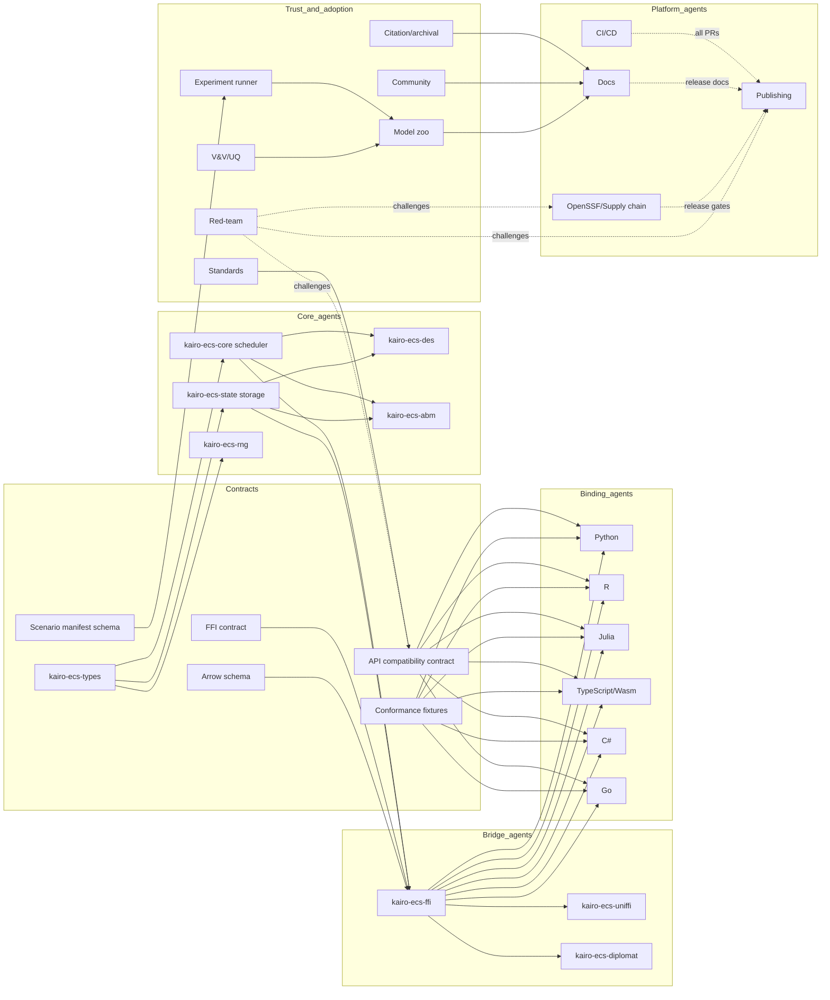

# KairoECS Track Map

KairoECS uses Conductor tracks as independently reviewable units of work. The roadmap is intentionally contract-first so subagents can work in parallel without corrupting core semantics or fragmenting the cross-language API.

## Track list

| Track | Name | Purpose | Primary subagent | Parallelism |
|---:|---|---|---|---|
| 00 | Project Foundation, Governance & Naming | Repo, governance, license, name and trademark due diligence | foundation-agent | Starts immediately |
| 01 | The Heart: kairo-ecs-core & kairo-ecs-state | Scheduler, SimTime, event queue, ECS state | core-scheduler-agent + ecs-agent | Split into contracts/core/ECS/RNG lanes |
| 02 | The Bridge: kairo-ecs-ffi, UniFFI & Diplomat | Stable ABI and generated binding facades | ffi-agent + uniffi-agent + diplomat-agent | Design during Track 01 after contracts |
| 03 | The Flow: DES Trajectory API & ABM Behavior API | User modelling APIs over one entity/event substrate | des-api-agent + abm-api-agent | Parallel with Arrow after core contract |
| 04 | The Analyst: kairo-ecs-arrow | Arrow telemetry, event traces, snapshots, IPC/Parquet | arrow-agent | Parallel after schema contract |
| 05 | The Window: kairo-ecs-viz | Optional visualization and snapshot viewers | viz-agent | Parallel after ECS snapshot contract; never core blocker |
| 06 | Python Binding 3.10-3.14 | Python package, wheels, pyarrow examples, free-threaded checks | python-agent | Parallel with other bindings after FFI RC |
| 07 | R Binding | R package, external pointers, Arrow examples | r-agent | Parallel with other bindings after FFI RC |
| 08 | Julia Binding | Julia package, Artifacts/JLL path, Arrow.jl examples | julia-agent | Parallel with other bindings after FFI RC |
| 09 | TypeScript/Wasm Binding | npm/Wasm package for Node/browser | typescript-agent | Parallel with other bindings after FFI RC |
| 10 | C# Binding .NET 10-11 | NuGet wrapper, SafeHandle, net10.0 and net11.0 lanes | csharp-agent | .NET 10 stable; .NET 11 preview/GA-gated |
| 11 | Go Binding | Go module over cgo and C ABI | go-agent | Parallel with other bindings after FFI RC |
| 12 | Conformance, Testing & Benchmarks | Shared fixtures, golden traces, performance baselines | conformance-agent + performance-agent | Starts early and expands continuously |
| 13 | CI/CD, Code Quality & Supply Chain | GitHub Actions, scans, dependency automation | ci-agent + security-agent | Starts immediately |
| 14 | Documentation Site & Education | GitHub Pages, docs, tutorials, API docs links | docs-agent | Starts immediately |
| 15 | Packaging, Publishing & Delivery | Registry workflows, release artifacts, dry runs | release-agent | Scaffolds early; releases late |
| 16 | Release Governance & Maintenance | Compatibility, deprecation, maintenance process | release-agent + governance-agent | Starts immediately |
| 17 | Community Adoption, Education & Ecosystem | Tutorials, contributor funnel, discussions, outreach | community-agent | Starts after docs skeleton |
| 18 | Comparative Benchmarks & Reproducibility | Repeatable benchmark suite against ecosystem baselines | benchmark-agent | Starts after first core benchmark harness |
| 19 | Research Software, Citation & Archival | CITATION, CodeMeta, Zenodo/JOSS readiness | research-agent | Starts immediately |
| 20 | OpenSSF, Supply Chain Trust & Institutional Readiness | Scorecard, badge, SBOM, attestations, SLSA goals | security-agent | Starts immediately; gates release |
| 21 | Verification, Validation & Uncertainty | Replay, seed/scenario manifests, validation and UQ hooks | vv-uq-agent | Starts after event trace contract |
| 22 | Experiment Runner & Scenario Management | Parameter sweeps, replications, resumable scenario batches | experiment-agent | Starts after telemetry + core run controls |
| 23 | Domain Starter Kits & Model Zoo | DES/ABM/hybrid examples and templates | model-zoo-agent | Starts after Flow API draft |
| 24 | Playground, Demos & Visualization UX | Browser demos, event timeline, Arrow viewer | playground-agent | Starts after Wasm + viz contracts |
| 25 | API Design Review & Compatibility Governance | Cross-language API review and compatibility matrix | api-governance-agent | Starts before public bindings |
| 26 | Interoperability Standards Review | DEVS/FMI/SBML/OpenTelemetry/Arrow mappings | standards-agent | Starts during architecture review |
| 27 | Developer Experience & Reproducible Environments | Devcontainer, devbox/mise, bootstrap scripts, task runner | dx-agent | Starts immediately; supports all subagents |
| 28 | Red Team & Devil's Advocate Review | Continuous adversarial review of roadmap, architecture, governance, release | redteam-agent | Starts immediately and recurs before releases |
| 29 | Wave Manager & Execution Gatekeeper | Enforce wave policy (waves 0-5), validate dependency closure, own critical path gates | wave-manager-agent | Starts immediately alongside all tracks |
| 30 | Toolchain & Version Support Matrix | Own cross-language toolchain version matrix, version-drop policy, CI coverage | toolchain-agent | Starts immediately |
| 31 | Performance Regression Guard | Automated performance regression detection, threshold-based CI comparison gates | perf-regression-agent | Starts after benchmark harness and comparative benchmarks scaffold |
| 32 | GPU Compute Acceleration | GPU-accelerated ECS operations, CUDA/Vulkan/OpenCL backends | gpu-compute-agent | After core scheduler |
| 33 | WebGPU Compute for Browser | WebGPU-based browser-side compute via Wasm shaders | webgpu-agent | After Wasm binding and GPU kernel design |
| 34 | PDES & Parallel Execution | Parallel discrete-event simulation engine with GVT | pdes-agent | After sequential scheduler contract |
| 35 | Distributed Simulation (MPI/gRPC) | Multi-node distributed simulation via MPI and gRPC | distributed-agent | After PDES LP model |
| 36 | Streaming & Real-Time Processing | Real-time telemetry streaming via Kafka/Arrow Flight | streaming-agent | After Arrow telemetry and experiment runner |
| 37 | ML/AI Integration & Inference | ONNX/ORT inference and Gymnasium environments for surrogate modeling | ml-integration-agent | After model zoo |
| 38 | FMI/FMU & Digital Twin Bridge | FMI 3.0 import/export, Asset Administration Shell, digital twin co-simulation | fmi-agent | After standards review, streaming, and FFI |
| 39 | Cloud/HPC Batch Runners | Docker/Kubernetes runners, spot-instance checkpointing, batch job orchestration | cloud-agent | After experiment runner CLI and packaging |
| 40 | Time-Travel Debugging & Interactive Stepping | Deterministic trace/record/replay, breakpoints, forward/backward stepping | timetravel-agent | After deterministic core and conformance snapshots |

## Release-critical path

```text
00 Foundation/Naming/Governance
  -> 01 Core/ECS contracts
  -> 02 FFI contract
  -> 12 Conformance fixtures
  -> 13 CI/CD and supply chain gates
  -> 14 Documentation site
  -> 15 Packaging/delivery
  -> 16 Release governance
  -> 20 OpenSSF/trust gates
  -> 25 API compatibility review
  -> 28 Red-team review
  -> 29 Wave Manager gatekeeper
  -> 30 Toolchain version matrix
  -> 34 PDES & Parallel Execution (release-critical)
  -> 35 Distributed Simulation MPI/gRPC (release-critical)
  -> 38 FMI/FMU Digital Twin Bridge (release-critical)
```

## Expanded dependency DAG

```mermaid
flowchart TD
    T00[00 Foundation]
    T01[01 Core + ECS]
    T02[02 FFI Bridge]
    T03[03 DES + ABM APIs]
    T04[04 Arrow]
    T05[05 Viz]
    T06[06 Python 3.10-3.14]
    T07[07 R]
    T08[08 Julia]
    T09[09 TypeScript/Wasm]
    T10[10 C# .NET 10-11]
    T11[11 Go]
    T12[12 Conformance/Benchmarks]
    T13[13 CI/CD/Supply Chain]
    T14[14 Docs]
    T15[15 Packaging/Publishing]
    T16[16 Release Governance]
    T17[17 Community]
    T18[18 Comparative Benchmarks]
    T19[19 Citation/Archival]
    T20[20 OpenSSF/Trust]
    T21[21 V&V/UQ]
    T22[22 Experiment Runner]
    T23[23 Model Zoo]
    T24[24 Playground]
    T25[25 API Governance]
    T26[26 Standards]
    T27[27 DX Environments]
    T28[28 Red Team]
    T29[29 Wave Manager]
    T30[30 Toolchain Matrix]
    T31[31 Perf Regression]
    T32[32 GPU Compute]
    T33[33 WebGPU Browser]
    T34[34 PDES Parallel]
    T35[35 Distributed MPI/gRPC]
    T36[36 Streaming Real-Time]
    T37[37 ML/AI Inference]
    T38[38 FMI/FMU Digital Twin]
    T39[39 Cloud/HPC Batch]
    T40[40 Time-Travel Debug]

    T00 --> T01
    T00 --> T13
    T00 --> T14
    T00 --> T16
    T00 --> T17
    T00 --> T19
    T00 --> T20
    T00 --> T25
    T00 --> T26
    T00 --> T27
    T00 --> T28

    T27 --> T01
    T27 --> T02
    T27 --> T06
    T27 --> T10

    T01 --> T02
    T01 --> T03
    T01 --> T04
    T01 --> T05
    T01 --> T12
    T01 --> T18
    T01 --> T21
    T01 --> T22
    T01 --> T23

    T26 --> T03
    T26 --> T04
    T26 --> T25
    T12 --> T04

    T02 --> T06
    T02 --> T07
    T02 --> T08
    T02 --> T09
    T02 --> T10
    T02 --> T11
    T02 --> T25

    T03 --> T12
    T03 --> T21
    T03 --> T22
    T03 --> T23

    T04 --> T06
    T04 --> T07
    T04 --> T08
    T04 --> T09
    T04 --> T10
    T04 --> T11
    T04 --> T21
    T04 --> T22
    T04 --> T24

    T05 --> T14
    T05 --> T24
    T09 --> T24

    T06 --> T15
    T07 --> T15
    T08 --> T15
    T09 --> T15
    T10 --> T15
    T11 --> T15

    T12 --> T15
    T13 --> T15
    T14 --> T15
    T16 --> T15
    T17 --> T14
    T18 --> T14
    T19 --> T14
    T20 --> T15
    T21 --> T12
    T22 --> T12
    T23 --> T14
    T24 --> T14
    T25 --> T16
    T28 --> T20
    T28 --> T25
    T28 --> T15

    T00 --> T29
    T29 --> T01
    T29 --> T02
    T29 --> T13
    T29 --> T15

    T00 --> T30
    T13 --> T30
    T30 --> T06
    T30 --> T07
    T30 --> T08
    T30 --> T09
    T30 --> T10
    T30 --> T11

    T01 --> T31
    T12 --> T31
    T18 --> T31
    T31 --> T13

    T01 --> T32
    T32 --> T33
    T09 --> T33
    T01 --> T34
    T34 --> T35
    T04 --> T36
    T22 --> T36
    T22 --> T39
    T15 --> T39
    T23 --> T37
    T26 --> T38
    T36 --> T38
    T02 --> T38
    T01 --> T40
    T12 --> T40
```



## Subagent swimlanes



## Parallel-safe groups

### Group A: starts immediately

```text
00 Foundation/Governance/Naming
13 CI/CD skeleton
14 Documentation skeleton
16 Release governance policy
17 Community adoption skeleton
19 Research metadata
20 OpenSSF/SBOM/provenance plan
25 API review process
26 Standards review
27 Developer environments
  28 Red-team review
  29 Wave Manager gatekeeper
  30 Toolchain version matrix
```

### Group B: starts after core contracts

```text
01 Scheduler implementation
01 ECS implementation
01 RNG implementation
02 FFI contract/scaffold
03 DES API design
03 ABM API design
04 Arrow schema/builders
05 Visualization snapshot contract
18 Benchmark harness
21 V&V trace design
22 Experiment manifest design
23 Model zoo outline
```

### Group C: starts after FFI release candidate

```text
06 Python 3.10-3.14
07 R
08 Julia
09 TypeScript/Wasm
10 C# .NET 10-11
11 Go
15 Packaging dry runs
14 API docs generation
24 Playground scaffolding
```

### Group D: release hardening

```text
12 Conformance full matrix
13 Security and supply chain
14 Docs publishing
15 Registry publishing
16 Compatibility/deprecation policy
18 Comparative benchmark publication
19 Zenodo/JOSS readiness
20 OpenSSF attestation/SBOM gates
  21 Validation/uncertainty examples
  23 Model zoo release examples
  28 Red-team no-critical-blocker signoff
  29 Wave-policy enforcement gate
  30 Toolchain-matrix-current gate
  34 PDES & Parallel Execution (release-critical)
  35 Distributed Simulation MPI/gRPC (release-critical)
  38 FMI/FMU Digital Twin Bridge (release-critical)
```

### Group E: post-core enhancements

```text
  32 GPU Compute Acceleration
  33 WebGPU Compute for Browser
  36 Streaming & Real-Time Processing
  37 ML/AI Integration & Inference
  39 Cloud/HPC Batch Runners
  40 Time-Travel Debugging & Interactive Stepping
```

### Group F: performance quality assurance

```text
  31 Performance regression guard
```
