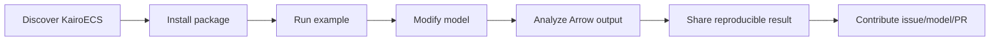

# Community Adoption Plan

## Adoption thesis

KairoECS will be adopted only if users can solve recognizable simulation problems within minutes and contributors can find useful work within hours.

## Public surfaces

- Discovery page with the project name, a short positioning line, and the first three actions a new visitor should take: install, run an example, read the contributor guide.
- `examples/` gallery with runnable DES, ABM, hybrid, and data-science examples, each labeled with maturity: `experimental`, `preview`, `stable`.
- Tutorials for first models in Rust and Python before all bindings are mature, with one command path per tutorial.
- Discussions categories: ideas, help, show-and-tell, benchmarks, model zoo, governance.
- Triage labels: `good first issue`, `help wanted`, `track:core`, `track:ffi`, `track:binding-python`, `needs-repro`, `needs-design-review`, `maturity:experimental`, `maturity:preview`, `maturity:stable`.
- Contributor UX entry points: contribution guide, code of conduct, issue templates, security policy, maintainer contact path, and release-note pointers.

## Community ladder

1. User
2. Contributor
3. Area reviewer
4. Maintainer
5. Release manager
6. Steering member

Promotion requires demonstrated review quality, care for users, and reliability; not just code volume.

## Adoption funnel

## Adoption release gate

Do not label the community surface as beta-ready until these are present and cross-linked:

- a discovery page with install and quickstart links
- at least one runnable DES example
- at least one runnable ABM example
- at least one runnable hybrid example
- contributor guide and issue templates
- maturity labels on examples and docs pages
- benchmark and reproducibility entry points
- a public path to security and governance contacts
