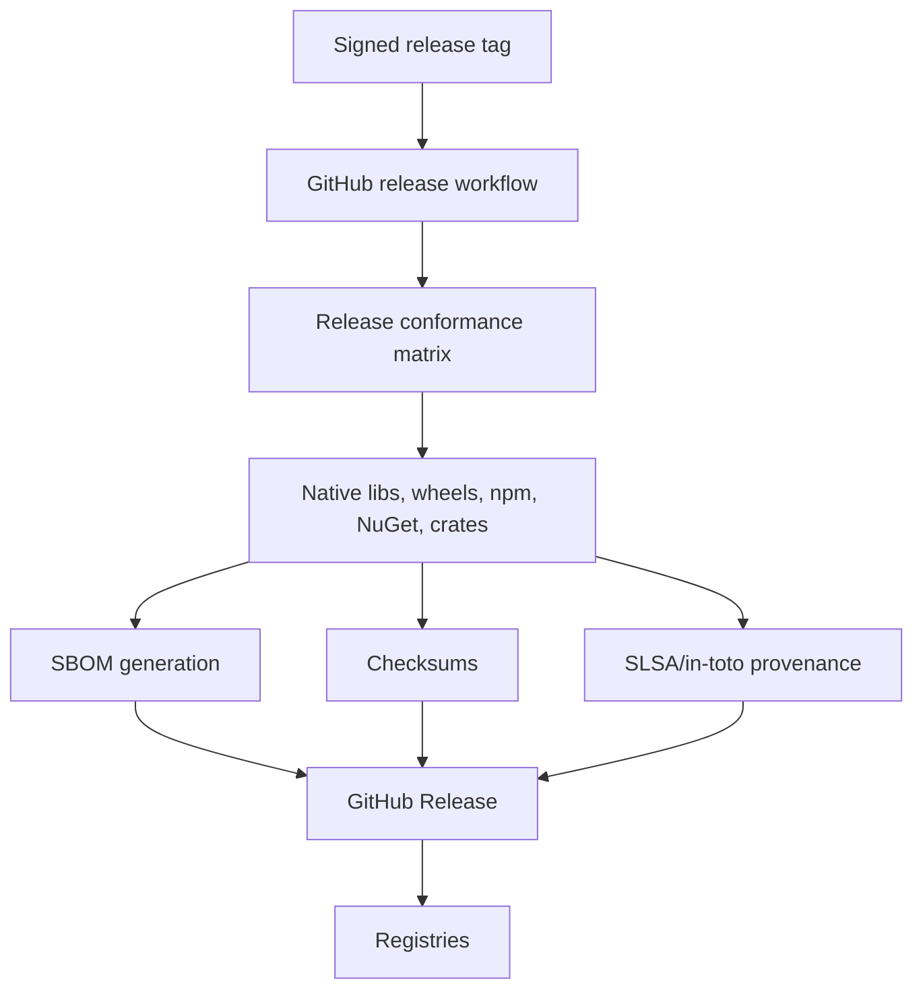

# OpenSSF and Institutional Trust Plan

## Security posture targets

| Maturity | Target |
|---|---|
| alpha | SECURITY.md, Dependabot/Renovate, CodeQL, cargo-audit, cargo-deny |
| beta | OpenSSF Scorecard workflow, SBOM generation, actionlint, zizmor, OSV scan |
| rc | signed artifacts, checksums, release provenance, dependency review |
| 1.0 | documented vulnerability response SLA and OpenSSF Best Practices Badge review |

## Artifact trust flow

## Required tools to evaluate

- OpenSSF Scorecard
- CodeQL
- cargo-audit
- cargo-deny
- cargo-semver-checks
- OSV Scanner
- Syft for SBOMs
- Cosign/Sigstore for artifact signing
- actionlint and zizmor for GitHub Actions hardening
- Dependabot or Renovate for dependency updates
