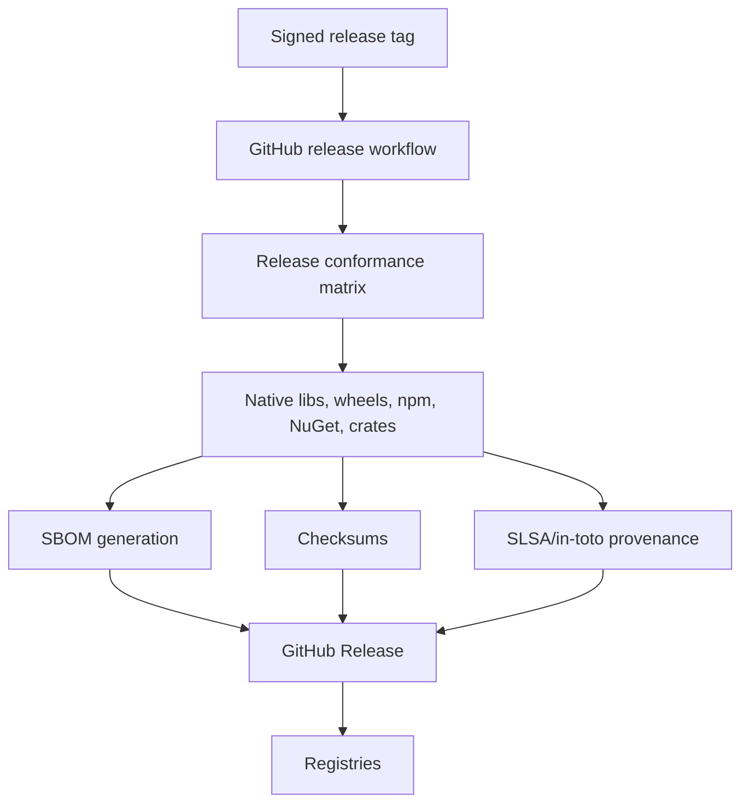

# OpenSSF and Institutional Trust Plan

## Security posture targets

| Maturity | Target |
|---|---|
| alpha | Security policy, ownership, dependency automation, static analysis, and advisory scanning are present and wired to CI. |
| beta | OpenSSF Scorecard, dependency review, SBOM dry-run, workflow hardening, and vulnerability response process are active. |
| rc | Release artifact tree has checksums, SBOM, attestations/provenance, and no unapproved high-severity dependency findings. |
| 1.0 | OpenSSF Best Practices Badge review, third-party audit plan, vulnerability SLA, and permanent waiver review are complete. |

## Release trust checklist

The release manager should treat this as the Track 20 source of truth. A row is green only when the evidence reference exists and the machine check passes, or when a recorded exception is approved under the exception process below.

| Evidence | Machine-checkable reference | Alpha | Beta | RC | 1.0 |
|---|---|---:|---:|---:|---:|
| Security policy and vulnerability intake | `SECURITY.md` | required | required | required | required |
| Maintained path ownership | `CODEOWNERS` and `.github/CODEOWNERS` | required | required | required | required |
| Dependency automation | `.github/dependabot.yml` or `renovate.json` | required | required | required | required |
| Static and advisory scanning plan | `.github/workflows/codeql.yml`, `cargo audit`, `cargo deny check` in `conductor/quality-gates.md` | required | required | required | required |
| OpenSSF Scorecard | `.github/workflows/scorecard.yml` | scaffold allowed | active | active | active |
| Dependency Review high-severity block | `.github/workflows/dependency-review.yml` with `fail-on-severity: high` | advisory | required | required | required |
| Workflow hardening | `.github/workflows/actions-security.yml` and `.github/workflows/workflow-security.yml` | advisory | required | required | required |
| Secret scanning | `.github/workflows/secret-scan.yml` | required | required | required | required |
| Release SBOM | `.github/workflows/sbom-attestations.yml`; `dist/sbom.spdx.json` or release artifact `sbom.spdx.json` | plan | dry-run | required | required |
| Release checksums | `dist/SHA256SUMS` | plan | dry-run | required | required |
| Release provenance/attestation | `.github/workflows/release-attestations.yml`; GitHub artifact attestation for release artifact tree | plan | dry-run | required where supported | required where supported |
| Release note trust claims | `CHANGELOG.md` or release notes name SBOM, checksums, provenance, and known exceptions | plan | required | required | required |
| OpenSSF Best Practices Badge | Badge checklist or review note linked from release notes | optional | started | review complete | required |
| Independent security audit | Auditor/funding/scope note for scheduler, FFI, Arrow, and supply chain | optional | planned | scheduled | report or accepted blocker |

## Machine-check references

These checks intentionally validate repository evidence rather than trusting prose:

```powershell
Test-Path SECURITY.md
Test-Path CODEOWNERS
Test-Path .github/CODEOWNERS
Test-Path .github/workflows/scorecard.yml
Test-Path .github/workflows/dependency-review.yml
Test-Path .github/workflows/sbom-attestations.yml
Test-Path .github/workflows/release-attestations.yml
Test-Path .github/workflows/actions-security.yml
Test-Path .github/workflows/workflow-security.yml
Test-Path .github/workflows/secret-scan.yml
rg -n "fail-on-severity:\s*high" .github/workflows/dependency-review.yml
rg -n "attestations:\s*write|actions/attest|sbom.spdx.json|SHA256SUMS" .github/workflows/sbom-attestations.yml .github/workflows/release-attestations.yml
rg -n "OpenSSF and supply-chain|scorecard.yml|dependency-review.yml|sbom-attestations.yml|release-attestations.yml|exception|waiver" conductor/quality-gates.md conductor/delivery-readiness-checklist.md
```

For a release artifact tree, run these checks against the built artifact directory before publishing:

```powershell
Test-Path dist/RELEASE.txt
Test-Path dist/SHA256SUMS
Test-Path dist/sbom.spdx.json
```

If the artifact tree is named differently, the release manager must record the actual artifact path in the release notes and in the workflow dispatch input for `sbom-attestations.yml` and `release-attestations.yml`.

## Exception handling

Exceptions are not a substitute for missing evidence. They are release decisions with an owner, expiry, and explicit stage impact.

| Exception type | Use when | Approval | Blocks |
|---|---|---|---|
| Temporary operational exception | A required tool is unavailable, the hosted runner lacks support, or an ecosystem cannot yet emit provenance despite the policy intent. | Security owner plus release owner. | May unblock alpha or beta only when documented as allowed-failure. |
| Release-stage exception | A required evidence item fails but the release manager proposes proceeding with a documented mitigation. | Security owner, release owner, and one maintainer outside the affected track. | Blocks RC and 1.0 until approved and expiry is set. |
| Permanent policy waiver | The project intentionally will not implement a control. | Maintainer decision plus ADR. | Blocks beta and later until the ADR is accepted. |

Every exception record must include:

- control name and failing command or missing file;
- affected release stage;
- reason and user impact;
- compensating control;
- approver names or handles;
- expiry date or condition;
- follow-up issue or ADR reference.

Allowed-failure lanes are temporary operational exceptions only. They must not be cited as permanent waivers, and they expire at the next release stage unless renewed.

## Artifact trust flow



## Required tools to evaluate

- OpenSSF Scorecard
- CodeQL
- cargo-audit
- cargo-deny
- cargo-semver-checks
- OSV Scanner
- Syft for SBOMs
- Cosign/Sigstore for artifact signing
- actionlint and zizmor for GitHub Actions hardening
- Dependabot or Renovate for dependency updates
