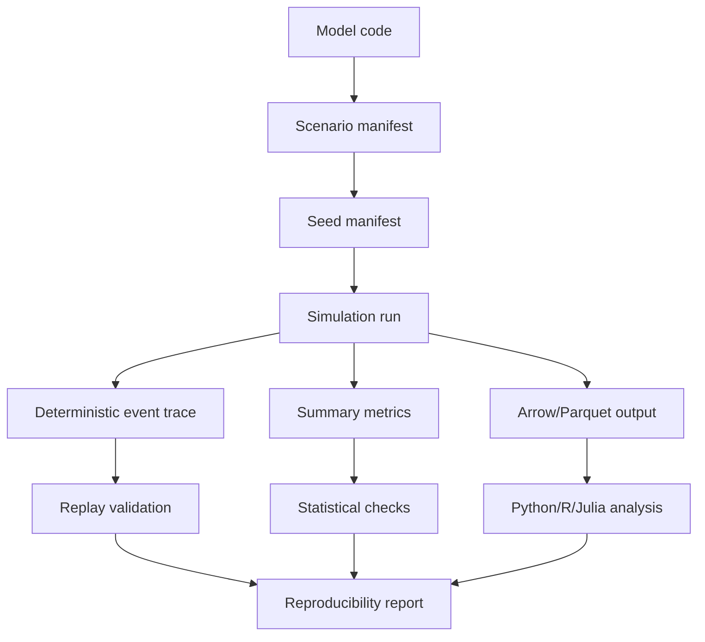

# Verification, Validation & Uncertainty Plan

## Trustworthy simulation workflow



## Features

- deterministic replay
- seed manifest
- scenario manifest
- golden trace replay
- Monte Carlo replications
- confidence intervals
- sensitivity hooks
- calibration hooks
- output comparison tools
- audit trail for warm-start/digital twin snapshots

## Minimum viable V&V API

```text
kairoecs verify trace <trace.arrow>
kairoecs replay <scenario.toml> --trace expected.arrow
kairoecs compare-runs baseline.arrow candidate.arrow
kairoecs summarize uncertainty outputs/*.arrow
```
