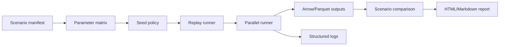

# Experiment Runner Plan

## Proposed crate/package

`kairo-ecs-experiment`

## Purpose

Run replications, parameter sweeps, and scenario batches reproducibly across local machines, CI, and HPC/cloud environments.

## Scenario manifest sketch

```toml
[model]
name = "factory_bottleneck"
version = "0.1.0"
entrypoint = "examples/des/factory_bottleneck"

[simulation]
until = "8h"
replications = 100
base_seed = 12345

[parameters]
arrival_rate = [0.8, 1.0, 1.2]
service_rate = [1.0, 1.1]

[replay]
fixture_id = "scheduler_ordering_v1"
fixture_path = "conformance/fixtures/deterministic_ordering.json"

[output]
format = "arrow"
path = "runs/factory_bottleneck"
```

## Replay command

```bash
cargo run -p kairo-ecs-cli -- replay --scenario examples/experiments/factory_bottleneck_v1.scenario.toml --seed-manifest examples/experiments/factory_bottleneck_v1.seeds.toml --output target/kairo-ecs-smoke/factory_bottleneck_v1
```

## Output shape

The runner should write:

- `runs/factory_bottleneck/manifest.json`
- `runs/factory_bottleneck/replications.parquet`
- `runs/factory_bottleneck/summary.json`
- `runs/factory_bottleneck/replay-comparison.json`

## Comparison flow

1. Load the scenario manifest.
2. Load the seed manifest.
3. Replay the selected fixture, such as `scheduler_ordering_v1`.
4. Compare the replay trace to the stored output manifest and summary metrics.
5. Emit a comparison report for release-gate review.

## Experiment data flow


