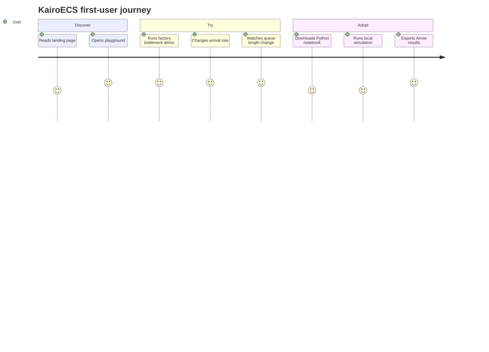

# Playground, Demos & Visualization UX Plan

## Goal

Make KairoECS understandable through interactive examples before users install a toolchain.

## Components

- Wasm demo runner
- event timeline inspector
- queue/resource visualizer
- agent map visualizer
- Arrow telemetry table/chart viewer

## Public entry points

- `docs/community/playground.md` is the user-facing explanation of the playground.
- `website/src/index.md` links to the playground from the docs home page.

## Concrete user flow

1. User opens the docs home page.
2. User sees the community playground link alongside the other docs sections.
3. User opens the playground page and chooses one of the named demo targets.
4. User inspects the screenshot targets or preview assets for the timeline, queue, and Arrow views.
5. User uses the example gallery links to move from the docs page into the repo examples.

## Screenshot and asset targets

- `website/public/images/playground/home.png`
- `website/public/images/playground/timeline.png`
- `website/public/images/playground/resource-queue.png`
- `website/public/images/playground/arrow-table.png`
- `website/public/images/playground/example-gallery.png`

## Example references

- `examples/des/mm1_queue/`
- `examples/des/factory_bottleneck/`
- `examples/abm/schelling/`
- `examples/abm/flocking/`
- `examples/hybrid/emergency_department_flow/`
- `examples/hybrid/supply_chain_disruption/`
- `examples/model-zoo/README.md`

## Claim boundary

- The playground explains the repo and its example surfaces.
- The page does not claim production visualization completeness.
- Missing screenshots or assets should be described as pending, not implied to exist.

## UX flow

