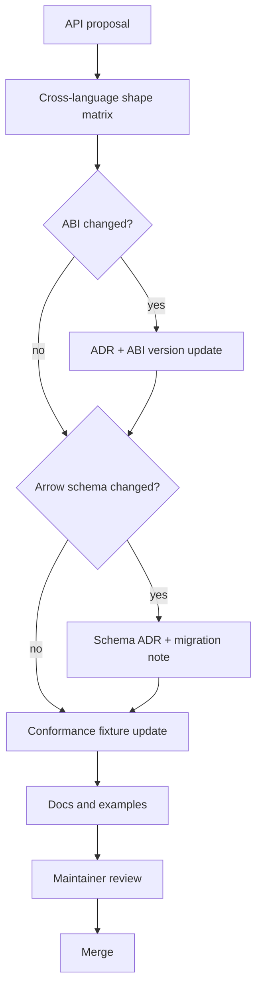

# API Design Review & Compatibility Governance Plan

## Mandatory API review questions

Every public feature must answer:

1. What is the Rust API?
2. What is the C ABI shape?
3. What is the Python API?
4. What is the R API?
5. What is the Julia API?
6. What is the TypeScript API?
7. What is the C# API?
8. What is the Go API?
9. Does this change Arrow schemas?
10. Does this change conformance fixtures?
11. Is it batch-friendly?
12. Does it preserve deterministic replay?

## Review gate

