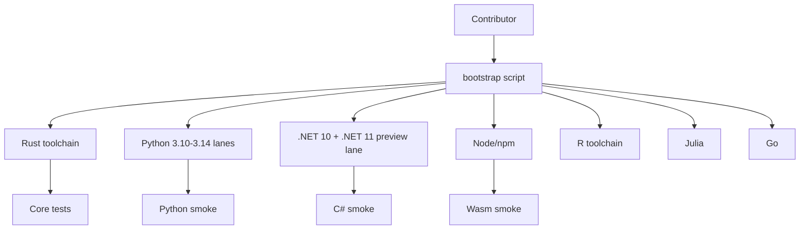

# Developer Experience & Reproducible Environments Plan

## Goal

A new contributor should be able to run core tests, docs, and at least one binding smoke test without hand-assembling the toolchain.

## Environment strategy

| Environment | Purpose |
|---|---|
| `rust-toolchain.toml` | pinned Rust channel/components |
| `.devcontainer/` | default contributor environment |
| `flake.nix` or `devbox.json` | reproducible local/HPC environments |
| `justfile` | task runner for common commands |
| `scripts/bootstrap.*` | first-run setup |
| `mise.toml` or `.tool-versions` | language version hints |
| `website/` | local docs build and preview commands |

## Toolchain diagram

## Concrete commands

- `just docs-bootstrap` installs the site dependencies.
- `just docs-build` generates `website/build/index.html`.
- `just docs-dev` starts a local preview on port 3000.
- `just validate-conductor` checks the conductor setup wiring.
