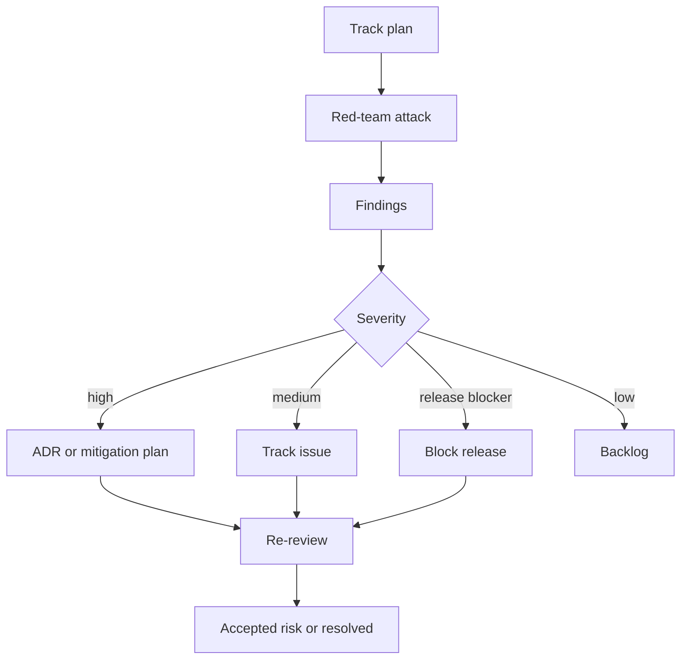

# Red Team & Devil's Advocate Review Plan

## Mission

Continuously challenge the project so risks are surfaced before the community, registries, security researchers, or skeptical users find them.

## Cadence

- Every track start: pre-mortem.
- Every design ADR: devil's advocate review.
- Every release candidate: red-team release review.
- Every public performance claim: benchmark adversarial review.

## Review dimensions

1. Architecture risk
2. FFI/ABI safety risk
3. Determinism/reproducibility risk
4. Performance claim risk
5. Cross-language API drift
6. Registry/publishing risk
7. Security/supply-chain risk
8. Governance/community risk
9. Documentation/adoption risk
10. Maintainer burnout risk

## Feedback loop

