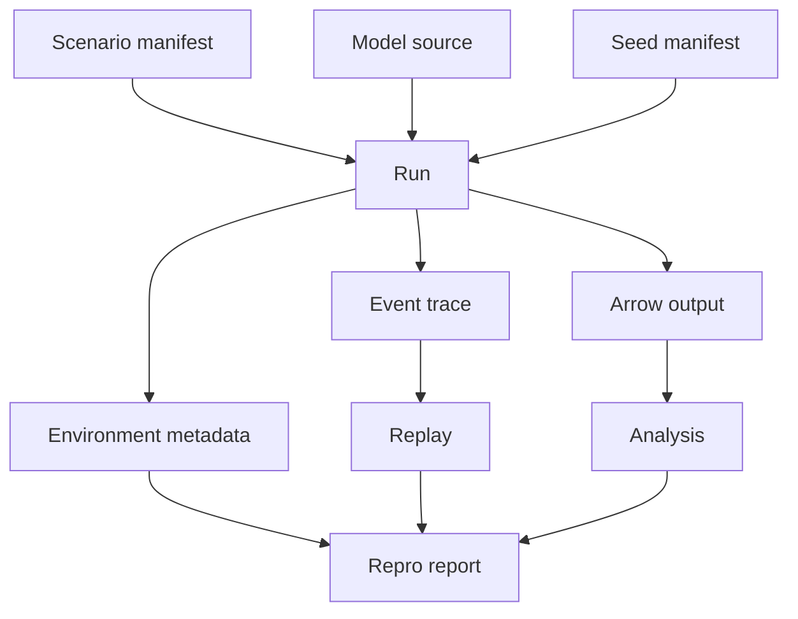

# Trustworthy Simulation Workflow

KairoECS should treat reproducibility and validation as product features.

## Required run artifacts

Every serious run should be able to emit:

- model manifest
- scenario manifest
- seed manifest
- simulation configuration
- event trace metadata
- Arrow/Parquet output
- package versions
- platform information
- deterministic replay command

## CLI sketch

```bash
kairoecs run scenario.toml --out runs/ed-flow-001
kairoecs verify runs/ed-flow-001
kairoecs replay runs/ed-flow-001/manifest.toml
kairoecs compare runs/baseline runs/candidate
kairoecs summarize runs/experiment-*/metrics.arrow
```

## Mermaid: trustworthy run


