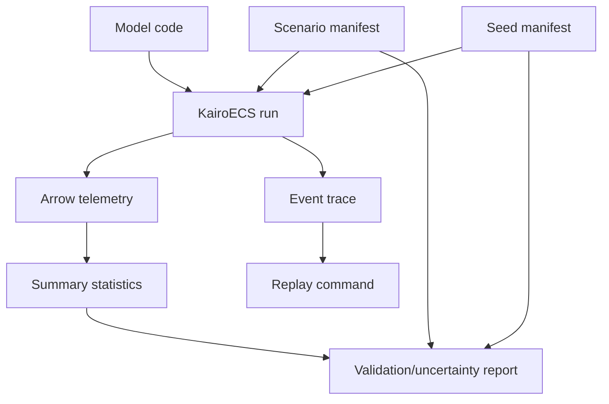

# Verification, Validation and Uncertainty Plan

## Definitions

- Verification: did we build the model/engine right?
- Validation: does the model adequately represent the real-world system for the intended purpose?
- Uncertainty: how sensitive are outputs to stochasticity, parameters, assumptions, and calibration choices?

## KairoECS trust artifacts

Every serious example should be able to emit:

```text
scenario manifest
seed manifest
event trace
entity snapshot summary
Arrow/Parquet telemetry
summary statistics
replay command
validation report if reference data exists
uncertainty report for replications
```

## Initial feature set

| Feature | Purpose |
|---|---|
| Deterministic replay | Debug and reproduce exact runs. |
| Seed manifest | Record RNG stream allocation. |
| Scenario manifest | Record model parameters and environment. |
| Golden trace tests | Verify engine behavior across versions. |
| Statistical output checks | Detect drift across releases. |
| Monte Carlo runner | Replications and confidence intervals. |
| Sensitivity analysis hooks | Parameter influence analysis. |
| Calibration hooks | Fit to historical data where appropriate. |


