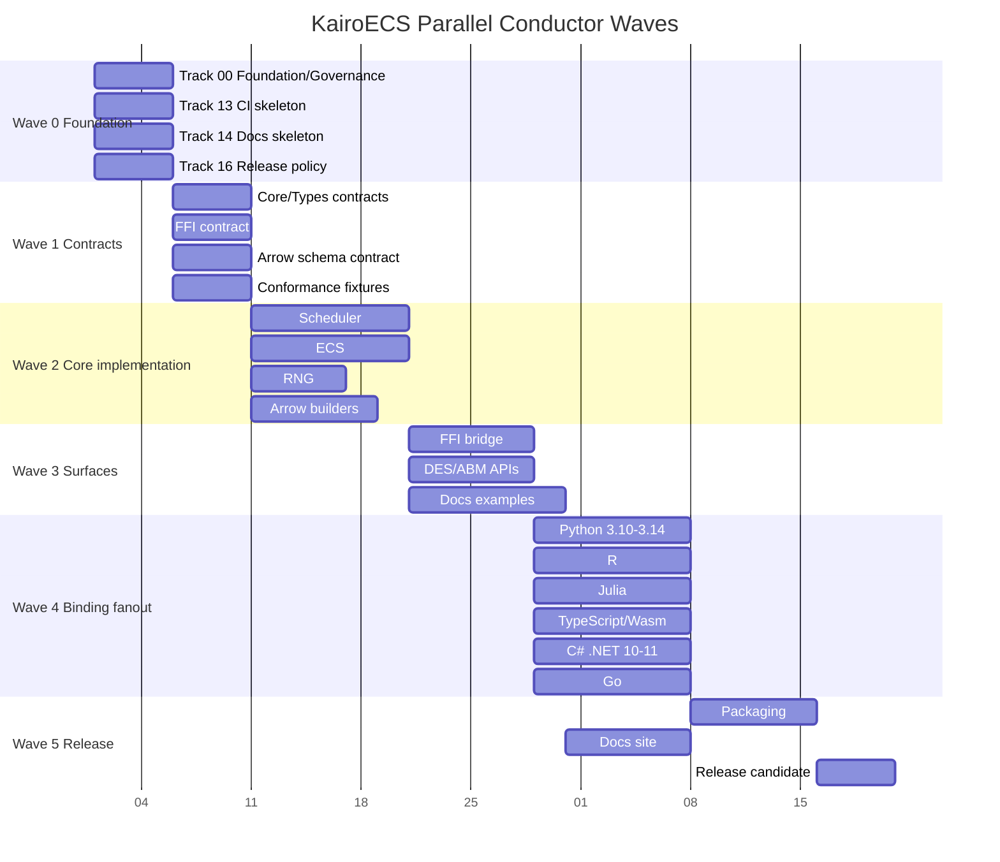

# KairoECS Conductor Workflow

## Principle

KairoECS uses a **contract-first, core-first, bindings-second** workflow.

```text
1. Define contracts.
2. Let subagents work in parallel within owned paths.
3. Integrate through conformance fixtures, not subjective API preference.
4. Promote to release only after docs, CI, packages, and compatibility gates pass.
```

## Contract-first execution

The project must establish these contract artifacts before broad implementation begins:

```text
conductor/contracts/core-contract.md
conductor/contracts/ffi-contract.md
conductor/contracts/arrow-schema-contract.md
conductor/contracts/conformance-contract.md
conductor/contracts/versioning-compatibility.md
```

These are the handoff points for subagents. A subagent may implement behind a mock, stub, or feature flag as long as it preserves the contract.

## Path ownership rule

Each subagent owns a narrow set of paths and should not modify another agent's path without a handoff note.

| Subagent | Primary paths |
|---|---|
| foundation-agent | root metadata, license, governance files |
| contracts-agent | `conductor/contracts/`, `crates/kairo-ecs-types/` |
| core-scheduler-agent | `crates/kairo-ecs-core/` |
| ecs-agent | `crates/kairo-ecs-state/` |
| ffi-agent | `crates/kairo-ecs-ffi/`, `include/` |
| uniffi-agent | `crates/kairo-ecs-uniffi/` |
| diplomat-agent | `crates/kairo-ecs-diplomat/` |
| des-api-agent | `crates/kairo-ecs-des/` |
| abm-api-agent | `crates/kairo-ecs-abm/` |
| arrow-agent | `crates/kairo-ecs-arrow/`, `schemas/arrow/` |
| viz-agent | `crates/kairo-ecs-viz/`, `examples/viz/` |
| python-agent | `bindings/python/` |
| r-agent | `bindings/r/` |
| julia-agent | `bindings/julia/` |
| typescript-agent | `bindings/typescript/`, `crates/kairo-ecs-wasm/` |
| csharp-agent | `bindings/csharp/` |
| go-agent | `bindings/go/` |
| conformance-agent | `conformance/`, `tests/conformance/` |
| performance-agent | `benches/`, `crates/kairo-ecs-bench/` |
| ci-agent | `.github/`, `deny.toml`, dependency automation |
| docs-agent | `docs/`, `website/` |
| release-agent | `packaging/`, `CHANGELOG.md`, release checklists |
| security-agent | `SECURITY.md`, advisories, supply-chain policy |

## Required artifact shape per track

Every track should contain:

```text
spec.md
plan.md
agent-contract.md
risk-register.md
test-matrix.md
handoff.md
```

At minimum, every `spec.md` must define:

```text
Inputs
Outputs
Owned paths
Blocked paths
Dependencies
Parallel-safe tracks
Acceptance criteria
Quality gates
Release implications
```

## Development waves



## Merge protocol

1. Subagent opens a PR against its track branch.
2. CI must pass for the owned surface.
3. Conformance fixtures must pass when relevant.
4. Public contract changes require an ADR and versioning note.
5. Integration happens through a merge queue or integration branch.
6. Release branch only accepts PRs with docs and tests.

## Definition of done

A track is not done when the code compiles. A track is done when:

```text
spec accepted
plan executed
unit tests pass
integration/conformance tests pass where applicable
benchmarks recorded if performance-sensitive
docs updated
release notes updated
quality gates pass
handoff file written
```

## Automatic phase closeout gate

Every non-terminal track must close each phase through the same review-fix-cleanup loop before the next phase starts:

1. Run `$conductor-review` against the track and current diff.
2. Auto-apply accepted review fixes inside the track's owned paths.
3. Record rejected, cross-track, or blocked-path fixes in `handoff.md`.
4. Update `conductor/phase-closeout.yaml` with review outcome, accepted fixes, validation commands, cleanup state, commit SHA or blocker, pushed ref, and next-phase decision.
5. Run `pwsh -NoProfile -File scripts/validate_conductor_phase_gates.ps1` plus the gates listed in `test-matrix.md`.
6. Commit and push the cleaned slice, then record the commit SHA or blocker in `handoff.md`.
7. Advance the next phase only after there is no in-scope unstaged or untracked work except documented draft satellites.

## Handoff timing rule

Handoff.md must follow this lifecycle:

1. **Phase 0-3**: handoff.md is a draft. It may say "No code files were changed in this handoff pass" or similar placeholder text.
2. **Phase 4 (Cross-track integration)**: handoff.md is updated with actual changed files, contracts consumed, and tests added.
3. **Phase 5 (Closeout)**: handoff.md is finalised with resolved risks, follow-up issues, and integration notes.

CI lint rule: If a track is `In Progress` or higher and its handoff.md contains the phrase "No code files were changed", CI emits a warning — the handoff may be stale.
