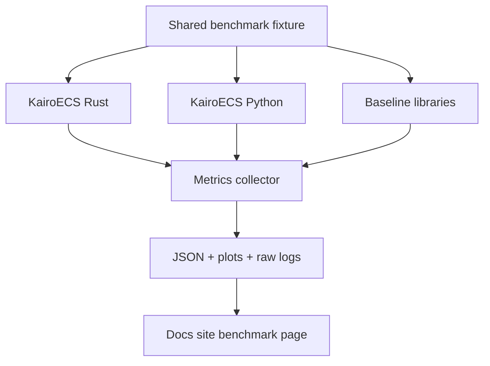

# Benchmarks and Reproducibility Plan

## Benchmark principles

- Benchmark whole workflows and micro-operations.
- Publish hardware, OS, compiler, commit SHA, feature flags, and package versions.
- Compare against credible baselines without mocking away their strengths.
- Avoid claims like “fastest” unless the benchmark is broad and reproducible.
- Treat the committed inventory as the source of truth:
  - ready fixture IDs: `scheduler_ordering_v1`, `scheduler_cancellation_v1`, `rng_reproducibility_v1`
  - canonical benchmark scenarios: `schedule_1m_events`, `pop_1m_events`, `schedule_cancel_1m_mixed`, `create_1m_entities`, `component_insert_1m`, `hybrid_des_abm_smoke_100k`

## Baseline candidates

| Paradigm | Ecosystem | Candidate baseline |
|---|---|---|
| DES | Python | SimPy, salabim |
| DES | R | simmer |
| DES | Julia | ConcurrentSim.jl |
| ABM | Python | Mesa |
| ABM | Julia | Agents.jl |
| DES | C# | SimSharp |
| Hybrid | Commercial conceptual benchmark | AnyLogic-style examples; no direct performance comparison unless licensed/appropriate |

## Metrics

```text
events/sec
scheduled events/sec
cancelled events/sec
memory per event
memory per entity
resource queue throughput
agent decisions/sec
Arrow export throughput
binding call overhead
cold import/startup time
scenario replication throughput
```

## Required outputs

```text
benchmark-result.json
benchmark-environment.json
benchmark-command.sh
raw criterion output
plots for docs site
caveats and fairness notes
```

Raw benchmark results are kept as emitted by the harness. The documented summary may be rendered into JSON, Arrow, or markdown for the docs site, but the captured raw criterion output and environment/command files remain the evidence of record for comparison claims.


