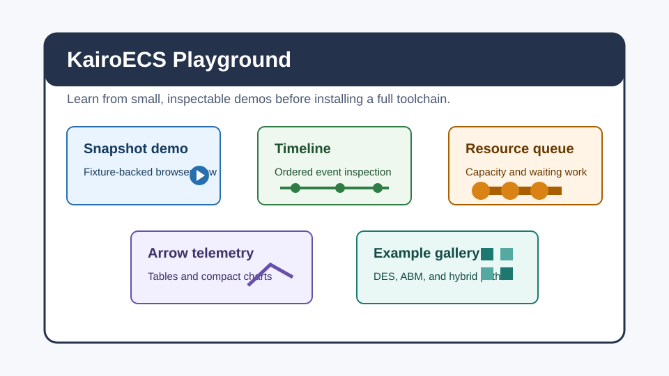
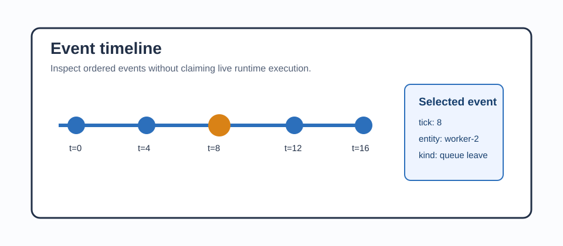
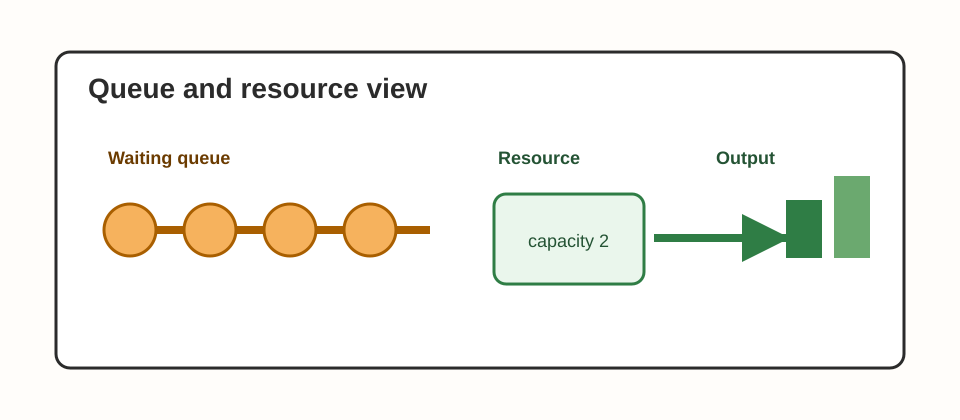
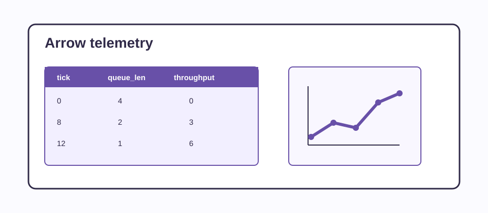
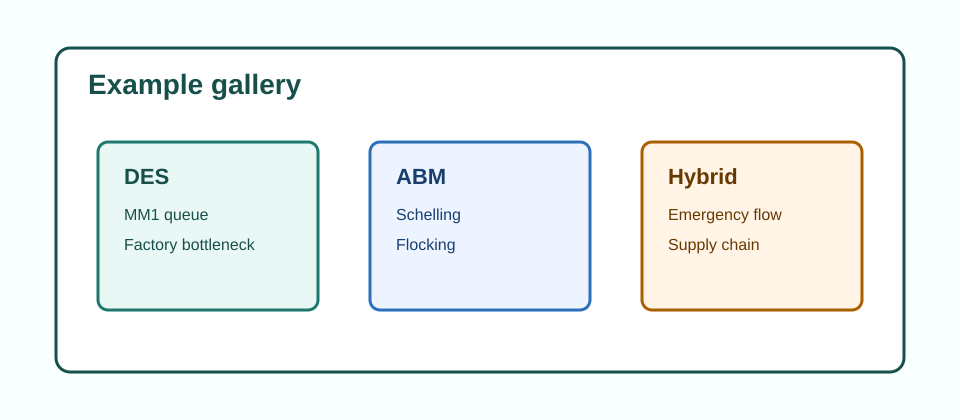

# KairoECS Playground

The playground is the browser-first entry point for understanding KairoECS before you install a toolchain or run the full workspace. It is not a separate product line. It is a docs-led demo surface that explains the current state of the repo with small, inspectable examples.

The first committed playground page is [the headless snapshot slice](../playground/headless-snapshot.md), which anchors the browser demo and smoke test.

## What the user should see

The playground page should present:

- a short intro that says the playground is for learning, not for production simulation work
- an entry tile for the Wasm demo runner
- an entry tile for the event timeline inspector
- an entry tile for the queue and resource visualizer
- an entry tile for the Arrow telemetry table and chart view
- an entry tile for the example gallery that points at the existing repo examples

## Concrete demo targets

These are the first demo targets the page should reference:

- `website/playground/index.html` anchored to `examples/viz/headless-snapshot/`
- `examples/des/mm1_queue/`
- `examples/des/factory_bottleneck/`
- `examples/abm/schelling/`
- `examples/abm/flocking/`
- `examples/hybrid/emergency_department_flow/`
- `examples/hybrid/supply_chain_disruption/`
- `examples/model-zoo/README.md`

## Screenshot targets

The docs page should call out the screenshot or asset targets that make the playground reviewable:

- `website/public/images/playground/home.png`
- `website/public/images/playground/timeline.png`
- `website/public/images/playground/resource-queue.png`
- `website/public/images/playground/arrow-table.png`
- `website/public/images/playground/example-gallery.png`

If the screenshots are not yet checked in, the page should say they are pending assets rather than implying they already exist.

## Current committed figures

The current docs build uses lightweight SVG figures instead of bitmap screenshots. They are committed under `docs/assets/playground/` so reviewers can inspect them in source control and so the documentation remains buildable without a browser screenshot pipeline.



Source: Generated SVG documentation asset; conceptual figure, not a runtime screenshot.



Source: Generated SVG documentation asset; conceptual figure, not a runtime screenshot.



Source: Generated SVG documentation asset; conceptual figure, not a runtime screenshot.



Source: Generated SVG documentation asset; conceptual figure, not a runtime screenshot.



Source: Generated SVG documentation asset; conceptual figure, not a runtime screenshot.

Validate figure references and metadata with:

```powershell
node docs/assets/validate-playground-figures.mjs
```

## How the docs site links to it

The docs home page should link to this page from the community section so users can reach it from the first docs screen.
It should also link the headless snapshot slice so readers can move from the overview to the concrete fixture-backed demo in one step.

## What this page is for

- explain the playground entry points
- name the visible demo targets
- distinguish current docs from future visuals
- give reviewers a stable place to check whether the playground claim is honest

## First implemented slice

The first local playground page is `website/playground/index.html`. It renders `website/playground/headless-snapshot.json`, which is tied back to `examples/viz/headless-snapshot/src/main.rs`.

Run the focused smoke check with:

```powershell
node website/scripts/smoke-playground.mjs
```

Run the source example with:

```powershell
cargo run --manifest-path examples/viz/headless-snapshot/Cargo.toml
```

If the local Windows linker is not configured, use the non-linking check:

```powershell
cargo check --manifest-path examples/viz/headless-snapshot/Cargo.toml
```
