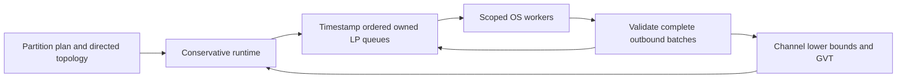

# Conservative single-host runtime

Maturity: preview. The `pdes` feature provides `ConservativeRuntime<P>` for
conservative event execution on real OS worker threads. Track 55 owns HPC parity
certification; these APIs do not assert distributed or cluster scaling.

The runtime owns event queues, LP processes, channel bounds and GVT. A model
implements `ConservativeProcess::on_event(&RemoteEvent) -> Vec<RemoteEvent>`;
it mutates only its owned LP state and returns events. `PartitionPlan` assigns
entities deterministically and supplies a positive lookahead. `new` checks that
process IDs and directed topology match the plan. Self events may target the
same tick; inter-LP events must respect positive lookahead.



An inbound channel advertises an exclusive lower bound: events with timestamp
strictly below it can execute. An event exactly at the bound waits for further
progress. A sender's queued work constrains what it may advertise, including
work beyond the caller's current horizon. Each round joins workers before
validating and delivering their outputs; queued and in-flight events constrain
GVT. Internally, local horizons are exclusive; the reported local proven tick
is one tick below that horizon. GVT takes the minimum of those proven ticks and
queued timestamps, capped at the caller's inclusive horizon. No messages remain
in flight after worker joins and atomic delivery. A remote event emitted at `T`
must have timestamp at least `T + lookahead`.
The rule uses the emitting event's timestamp, not a later batch horizon.

Events at the same destination and timestamp are ordered by source LP and
stable insertion sequence. Models whose transitions require a global
cross-partition order must express that dependency with causal events. LP state
must implement `Send`; mutable shared model state across LPs undermines the
partition contract and should be avoided.

Invalid ownership, routing, timestamps and lookahead fail with typed runtime
errors. Invalid handler output or a handler panic permanently poisons the
runtime: handler state may have changed before validation, so resuming would
hide partial execution. The outbound batch is validated before any event in it
is enqueued. Panics are surfaced as typed errors after joining workers.
`run_until_with_budget` bounds events per call; reaching the budget returns a
typed error after committed events and allows explicit resumption. The default
`run_until` budget is one million events, so a zero-delay self-event loop cannot
silently run forever. Horizon regression and arithmetic overflow are explicit
errors. Initial event injection closes once execution begins.

## Migrating from Track 34

`PdesScheduler`, `LogicalProcess` and `ThreadChannelTransport` remain available
with their original contracts for existing callers. They are the Track 34
compatibility scaffold. Their caller-owned queues, local-time callback and
transport interface do not provide the new runtime's worker or event ownership
guarantees. To migrate, move LP event handling into `ConservativeProcess`,
construct one process per `PartitionPlan` segment, declare directed neighbors,
seed initial events before execution, and read final owned state through
`processes()` after `run_until`.

## Reproducing correctness evidence

```sh
rustup run 1.98.1 cargo test -p kairo-ecs-pdes --features pdes --test production_parity
rustup run 1.98.1 cargo test -p kairo-ecs-pdes --features pdes --test production_protocol
```

Expected output: all tests pass. The versioned deterministic `production_parity`
fixture executes FIFO single-server DES arrivals/service completions, evolving
ABM agents/neighbor credits and mixed workloads through both the real core
`Scheduler` and `ConservativeRuntime`. It checks final LP state for 2 and 8 LPs
and seeds 7, 47 and 24301. Protocol tests additionally cover causality boundaries,
invalid routes and state, sparse progress, poisoning, and adversarial 8-LP
10,000-tick execution. [Benchmark evidence](benchmark-results.md) records the
separate throughput measurements and host limits.

## Handoff

Track 49 may consume `PartitionPlan`, `LpId`, `RemoteEvent`, and the exclusive
channel-bound semantics. Distributed transports must prove FIFO/ordered
channel handling and account for all in-flight events before advancing GVT;
the single-host runtime provides no network failure or recovery contract.
Track 55 may consume processed-event counts, rounds, null-message counts, GVT
history and reproducible raw strong/weak measurements. Thread creation and
synchronization overhead are included in measured runtime time. No changes to
core scheduler internals are required or authorized by this interface.
