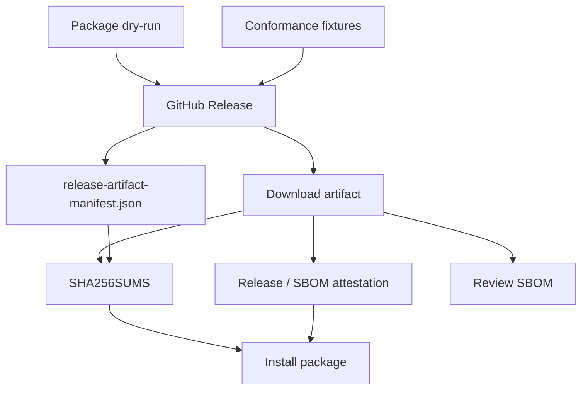

# Verifying Release Artifacts

KairoECS releases should provide a release artifact manifest, checksums, SBOMs,
artifact attestations/provenance, package registry links, and a source archive.
The release workflow writes `dist/release-artifact-manifest.json` and
`dist/SHA256SUMS` from `packaging/release-package-manifest.json`, and the
attestation workflows add the SBOM/provenance layer.

Package dry-runs and conformance fixtures are part of the release evidence, not
optional extras. A release should not advance if the package dry-run surface is
failing or if the ready fixture set has drifted. The package dry-run gate should
cover the checked-in package set: Rust, Python, R, Julia, TypeScript/Wasm,
C#, and Go.

For local R2 dry-run evidence, run:

```bash
python packaging/scripts/build_release_manifest.py --version 0.0.0-r2-dry-run
```

The generated manifest must keep `production_publish_enabled` set to `false`.


